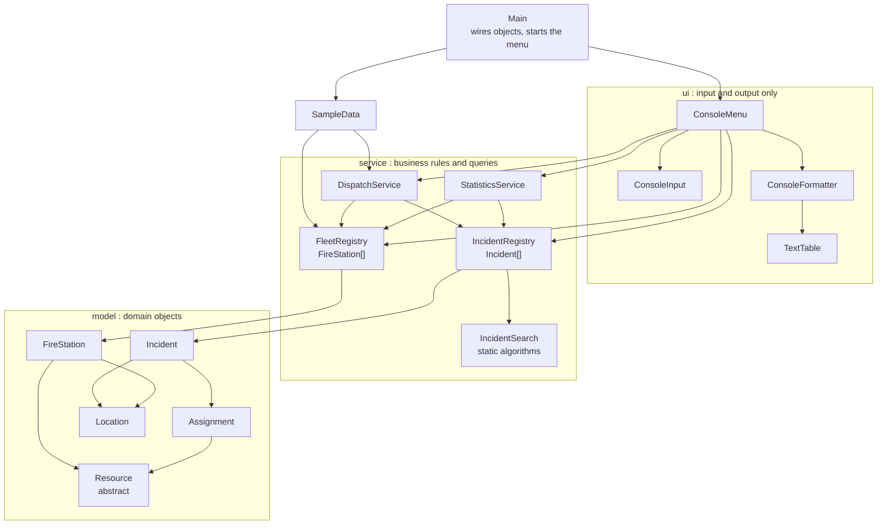
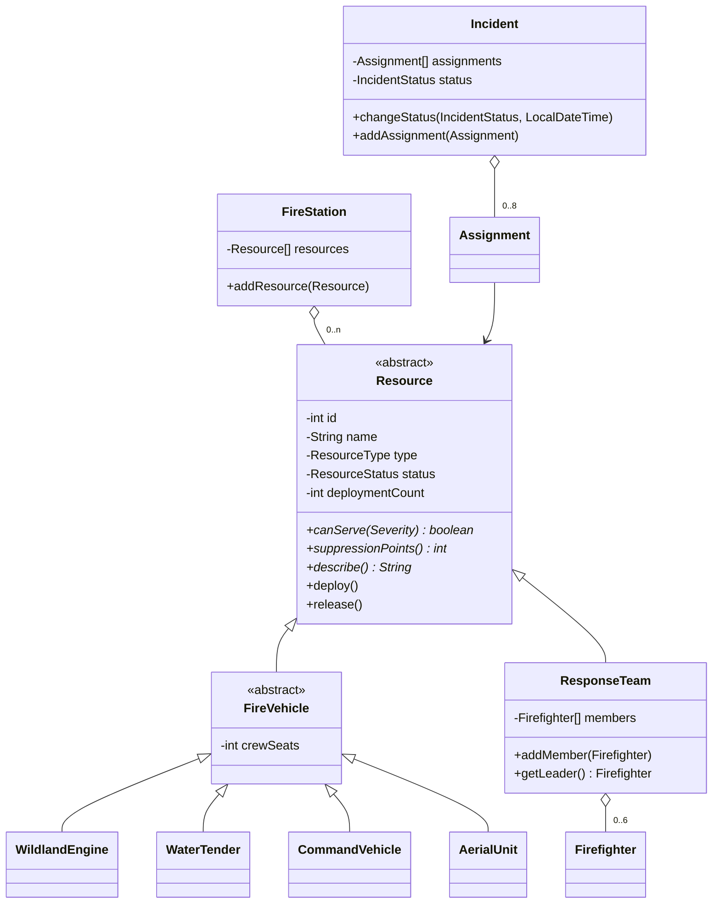

# CSC — Greek Fire Response Coordination System

[Ελληνικά](README.md) | **English**

A complete educational application from **Computer Science Center (CSC)**.

Education website: [https://csc.gr](https://csc.gr)

Maintainer: **Konstantinos Zitis**

| Project information | Value |
| --- | --- |
| Repository | `csc-java-fire-response-system` |
| Primary area | Java |
| Learning level | Intermediate |
| Documented release | [v1.0.0](https://github.com/ConstantinSummer/csc-java-fire-response-system/releases/tag/v1.0.0) ([release notes](RELEASE_NOTES.md)) |

## Project overview

**Greek Fire Response Coordination System** is a runnable Java console application that models how a fire service coordinates its response to wildfires in Greece. Learners register wildfire incidents, manage fire stations and their resources (engines, water tenders, command vehicles, helicopters, water bombers and ground crews), assign resources to incidents under real business rules, move incidents through their life cycle, and read statistics about incidents and resource utilisation.

It is written for learners who already know basic Java syntax and want to see how objects, arrays and clear responsibilities fit together in a program larger than a single exercise. The application deliberately stores everything in **plain arrays with explicit capacity** rather than in `ArrayList`, `HashMap`, streams or a database, so that indexes, capacity limits, searching and the limits of arrays are visible in the code.

Implemented features:

- Report a wildfire incident with location, severity, date/time and status (menu option 1).
- List active incidents, most severe first, with resourcing progress (option 2) and show full incident details with the assignment history (option 3).
- Assign a resource to an incident with rule checks: the resource must be available, suitable for the incident's severity and the incident must be open and have a free assignment slot (option 4).
- Change an incident's status through a checked state machine (option 5).
- Show all, available, deployed or out-of-service resources across every station (option 6) and take a resource out of service or return it (option 7).
- Search and filter incidents: by id with **linear and binary search side by side**, by region, minimum severity, status and free text (option 8).
- Suggest the nearest available, suitable resource of a chosen type and optionally assign it (option 9).
- Statistics by severity, status and region, including a region × severity table (option 10) and resource utilisation by type and station, plus the most frequently deployed resources (option 11).
- 14 preloaded incidents, 10 stations and 38 resources, so the application is interesting from the first run.
- Invalid input never terminates the program; every rule violation is reported and the menu continues.
- 70 automated tests (JUnit 5).

Scope and limitations: the baseline is a single-user, in-memory console application. Data is not saved between runs, and all incidents, stations, vehicles and people in the sample data are **fictional**; place names and coordinates are approximate. Dispatch rules (for example the "suppression points" scale) are educational simplifications, not real Fire Service procedures. All console output is plain ASCII so it displays correctly in every terminal, including the default Windows console.

### Learning workflow

1. Download or clone the documented release and complete setup.
2. Run the application and try the example workflow.
3. Study the source code using the architecture and concept references below.
4. Discuss design decisions and guided review questions during lessons.
5. Complete extension challenges and demonstrate that their acceptance criteria are met.

## Learning objectives

After studying and extending this application, learners should be able to:

- Explain how the model classes in [`model`](src/main/java/gr/csc/fireresponse/model) use **encapsulation, constructors and validation** to keep objects consistent (for example [`Incident`](src/main/java/gr/csc/fireresponse/model/Incident.java) and [`Location`](src/main/java/gr/csc/fireresponse/model/Location.java)).
- Trace an inheritance hierarchy and predict the result of a **polymorphic** call such as `resource.canServe(severity)` for each subclass of [`Resource`](src/main/java/gr/csc/fireresponse/model/Resource.java).
- Work with **one- and two-dimensional arrays**, explaining the difference between an array's capacity and the number of slots in use, and implement an array-based structure that enforces a capacity limit.
- Read and write **searching, filtering and sorting algorithms** on arrays (linear search, binary search, two-pass filtering, insertion sort) and compare their cost using the comparison counts the application prints.
- Distinguish **checked exceptions** (business-rule violations) from **unchecked exceptions** (invalid arguments) and show where each is thrown and handled.
- Model a life cycle with an **enum-based state machine** ([`IncidentStatus`](src/main/java/gr/csc/fireresponse/model/IncidentStatus.java)).
- Argue about **cohesion, coupling and separation of responsibilities** by deciding whether a rule belongs in the model, a service or the console UI.
- Evaluate the **limitations of arrays** and describe how the design would change for thousands of incidents and resources.
- Write focused JUnit tests for valid and invalid behaviour, using an injected `Clock` to make time predictable.

## Prerequisites

- Knowledge: Java syntax, variables, loops and conditionals, methods, and the basics of classes and objects; you do not need to know collections, streams or lambdas in advance (a small number of one-line lambdas appear in [`IncidentSearch`](src/main/java/gr/csc/fireresponse/service/IncidentSearch.java) and the tests and are explained in the source).
- Environment: Windows, Linux or macOS; Git; a terminal; JDK 17 or newer; Apache Maven 3.6.3 or newer. Internet access is needed once, so that Maven can download its plugins and JUnit.
- External resources: None. No account, service, database, hardware, dataset or paid tool is required.

## Technologies used

| Technology | Supported version | Role |
| --- | --- | --- |
| Java (JDK) | 17 or newer (compiled with `--release 17`) | Language and runtime; only the standard library is used at runtime |
| Apache Maven | 3.6.3 or newer | Build, test and packaging (`pom.xml`) |
| JUnit Jupiter (JUnit 5) | 5.10.2 | Automated tests (test scope only) |
| maven-compiler-plugin / surefire / jar | 3.13.0 / 3.2.5 / 3.4.1 | Compile, run tests, build an executable JAR |

There are no runtime dependencies, no database and no frameworks.

## Setup instructions

1. Clone the repository and select the documented release:

   ```text
   git clone https://github.com/ConstantinSummer/csc-java-fire-response-system.git
   cd csc-java-fire-response-system
   git checkout v1.0.0
   ```

2. Work in the repository root (the folder that contains `pom.xml`) for every command below.
3. Check the tools. `java -version` must report version 17 or higher and `mvn -version` version 3.6.3 or higher:

   ```text
   java -version
   mvn -version
   ```

4. No dependency installation step is needed: Maven downloads what it needs on the first build.
5. No configuration, environment variables or secrets are required, and no database or sample-data preparation is needed: the sample data is created in memory by [`SampleData`](src/main/java/gr/csc/fireresponse/data/SampleData.java) at start-up.
6. Verify the setup by compiling and running the automated tests:

   ```text
   mvn test
   ```

   Expected result: the summary contains `Tests run: 70, Failures: 0, Errors: 0, Skipped: 0` followed by `BUILD SUCCESS`.

## Execution instructions

### Start and stop

Build the executable JAR and start the application from the repository root:

```text
mvn package
java -jar target/csc-java-fire-response-system-1.0.0.jar
```

The application prints a numbered menu and waits for input. Choose `0` to exit. If the input ends (Ctrl+D on Linux/macOS, Ctrl+Z then Enter on Windows) it says `Input ended. Goodbye.` and stops cleanly.

An optional argument freezes the application clock, so that "now" is always the same moment and a session can be repeated exactly:

```text
java -jar target/csc-java-fire-response-system-1.0.0.jar --now=2026-08-14T16:00
```

### Example workflow

The file [`docs/examples/demo-input.txt`](docs/examples/demo-input.txt) contains every answer typed in the recorded session below: it lists incidents, makes a deliberate input mistake, reports a new incident in the Peloponnese, asks for the nearest available engine, attempts an invalid assignment, assigns a water tender, attempts an invalid status change, changes the status correctly, shows the incident details, compares linear and binary search, runs a text search, and prints the statistics and utilisation reports.

Replay it with the frozen clock (Linux, macOS, Git Bash or Windows `cmd`):

```text
java -jar target/csc-java-fire-response-system-1.0.0.jar --now=2026-08-14T16:00 < docs/examples/demo-input.txt
```

In Windows PowerShell, which does not support `<`, use:

```text
Get-Content docs/examples/demo-input.txt | java -jar target/csc-java-fire-response-system-1.0.0.jar --now=2026-08-14T16:00
```

The output is the same as the recorded session except that a terminal echoes the characters you type, while a replay does not show them.

**Recorded session** (real output of the application; `[...]` marks lines omitted from this excerpt). The full session is in [`docs/examples/demo-session.txt`](docs/examples/demo-session.txt).

Start-up, the menu, and the list of active incidents (menu option 2):

```text
===========================================
  Greek Fire Response Coordination System
===========================================
CSC - Computer Science Center | https://csc.gr | Educational sample data, not real incidents

MAIN MENU
   1. Report a new wildfire incident
   2. List active incidents
   3. Show incident details
   4. Assign a resource to an incident
   5. Change incident status
   6. Show fire service resources
   7. Set a resource out of service / return it to service
   8. Search and filter incidents
   9. Suggest the nearest available resource
  10. Statistics (severity / status / region)
  11. Resource utilisation
   0. Exit
Choose an option (0-11): 2

========================================
  Active incidents (most severe first)
========================================
+----+------------------+----------------+--------------------+----------+------------+-----------+---------+
| ID | Reported         | Region         | Area               | Severity | Status     | Resources | Points  |
+----+------------------+----------------+--------------------+----------+------------+-----------+---------+
|  3 | 2026-07-18 09:40 | Central Greece | Prokopi, Evia      | Critical | Active     |         6 | 187/200 |
| 12 | 2026-08-05 13:00 | Western Greece | Ancient Olympia    | Critical | Active     |         5 | 161/200 |
|  1 | 2026-07-15 13:20 | Attica         | Marathon foothills | High     | Active     |         3 |  86/120 |
|  4 | 2026-07-20 14:10 | Peloponnese    | Taygetos foothills | High     | Responding |         2 |  58/120 |
| 11 | 2026-08-03 16:20 | North Aegean   | Mytilene hills     | High     | Reported   |         0 |   0/120 |
|  2 | 2026-07-15 16:05 | Attica         | Penteli            | Moderate | Contained  |         3 |   84/60 |
|  6 | 2026-07-24 15:45 | South Aegean   | Laerma             | Moderate | Active     |         2 |   45/60 |
| 10 | 2026-08-02 12:30 | Ionian Islands | Pantokrator        | Moderate | Reported   |         0 |    0/60 |
|  5 | 2026-07-22 11:30 | Crete          | Apokoronas         | Low      | Reported   |         0 |    0/20 |
+----+------------------+----------------+--------------------+----------+------------+-----------+---------+
9 active of 14 recorded incidents (registry capacity 60). Points = assigned / recommended.
```

Wrong input is rejected and the menu continues (input `abc`); a new incident is reported with validated fields:

```text
Choose an option (0-11): abc
  ! Please enter a whole number between 0 and 11.
Choose an option (0-11): 1
Description: Brush fire near olive groves above Molaoi
Region:
[...]
Choose 1-13: 3
Area / locality: Molaoi
Latitude (34.5 to 42.0): 36.81
Longitude (19.0 to 29.9): 22.86
Severity:
  1. Low
  2. Moderate
  3. High
  4. Critical
Choose 1-4: 3
Reported at (yyyy-MM-dd HH:mm, Enter = now): 
Incident #15 reported (High, Molaoi, Peloponnese). Status: Reported.
```

Business rules at work: an unavailable resource is refused, a valid assignment succeeds, and an illegal status jump is refused:

```text
Incident id: 15
[...]
Resource id to assign: 1
  ! ATT-E1 is not available (status: Deployed)
[...]
Resource id to assign: 30
THE-WT1 assigned to incident #15. Resourcing is now 75 of 120 recommended points.
[...]
Incident id: 15
Current status: Reported
Allowed next statuses: Responding, False alarm
New status:
Choose 1-6: 3
  ! Cannot change status from Reported to Active
```

Incident details show the assignment history and the resourcing against the recommended points; the search menu exposes the cost of two algorithms:

```text
Incident id: 15
Incident #15: Brush fire near olive groves above Molaoi
  Location     : Molaoi, Peloponnese (36.810, 22.860)
  Severity     : High
  Status       : Responding
  Reported     : 2026-08-14 16:00
  Last update  : 2026-08-14 16:00
  Resourcing   : 75 of 120 recommended points (insufficient)
  Assignments  : 2 of 8 slots used
+----------+-----------------+---------------------------+------------------+----------+
| Resource | Type            | Station                   | Assigned         | Released |
+----------+-----------------+---------------------------+------------------+----------+
| CHN-E1   | Wildland engine | Chania Station            | 2026-08-14 16:00 | -        |
| THE-WT1  | Water tender    | Thessaloniki East Station | 2026-08-14 16:00 | -        |
+----------+-----------------+---------------------------+------------------+----------+
[...]
Search:
  1. By id (linear vs binary search)
  2. By region
  3. By minimum severity
  4. By status
  5. By text in description / area
Choose 1-5: 1
Incident id: 14
Linear search: found at index 13 after 14 comparisons
Binary search: found at index 13 after 3 comparisons
+----+------------------+-------------------+--------------+----------+-------------+-----------+--------+
| ID | Reported         | Region            | Area         | Severity | Status      | Resources | Points |
+----+------------------+-------------------+--------------+----------+-------------+-----------+--------+
| 14 | 2026-08-06 09:10 | Western Macedonia | Kozani plain | Moderate | False alarm |         0 |   0/60 |
+----+------------------+-------------------+--------------+----------+-------------+-----------+--------+
1 incident matches (most severe first).
```

### Verify behaviour

Run the automated tests (`mvn test`). They are organised around the behaviour the application must guarantee:

| Test class | Tests | What it verifies |
| --- | --- | --- |
| [`AssignmentTest`](src/test/java/gr/csc/fireresponse/service/AssignmentTest.java) | 10 | Valid assignment; invalid assignment (unavailable, closed incident, out of service, unsuitable severity, understaffed team, unknown ids); failed assignments leave no side effects |
| [`CapacityTest`](src/test/java/gr/csc/fireresponse/service/CapacityTest.java) | 7 | Capacity limits of incident assignments, stations, teams and both registries; id ordering invariant |
| [`StatusTransitionTest`](src/test/java/gr/csc/fireresponse/service/StatusTransitionTest.java) | 8 | Full life cycle, flare-up, illegal transitions, terminal states, the "needs a resource" rule, release of resources on closing |
| [`StatisticsTest`](src/test/java/gr/csc/fireresponse/service/StatisticsTest.java) | 8 | Counts by severity, status and region, the 2D matrix, utilisation, ranking of busiest resources |
| [`IncidentSearchTest`](src/test/java/gr/csc/fireresponse/service/IncidentSearchTest.java) | 11 | Linear and binary search (with comparison counts), filters, text search, insertion sort |
| [`DomainModelTest`](src/test/java/gr/csc/fireresponse/model/DomainModelTest.java) | 13 | Validation, polymorphic `canServe` table, suppression points, team leader, overloads |
| [`SampleDataTest`](src/test/java/gr/csc/fireresponse/data/SampleDataTest.java) | 4 | The preloaded data is consistent with the incident states |
| [`ConsoleMenuTest`](src/test/java/gr/csc/fireresponse/ui/ConsoleMenuTest.java) | 9 | Scripted console sessions: wrong input never terminates the program |

For manual validation, replay the recorded session as described above and compare the output with [`docs/examples/demo-session.txt`](docs/examples/demo-session.txt).

### Troubleshooting

| Symptom | Likely cause | Resolution |
| --- | --- | --- |
| `mvn` or `java` is not recognised | The tool is not installed or not on the `PATH` | Install JDK 17+ and Maven 3.6.3+, open a new terminal, and repeat `java -version` and `mvn -version` |
| `release version 17 not supported` or `invalid target release: 17` | Maven is using a JDK older than 17 | Point `JAVA_HOME` to a JDK 17+ installation and check `mvn -version` shows that JDK |
| `Unable to access jarfile target/...jar` | The JAR has not been built, or the command is run outside the repository root | Run `mvn package` in the folder that contains `pom.xml` |
| Maven cannot download plugins or JUnit | No internet access, or a proxy/firewall blocks Maven Central | Connect to the internet or configure your proxy in Maven's `settings.xml` |
| The program prints `Input ended. Goodbye.` immediately | Standard input is empty or already closed (for example an empty redirected file) | Run it interactively, or redirect a file that contains answers |
| `Invalid --now value` | The clock argument is not an ISO date-time | Use the form `--now=2026-08-14T16:00` |

## Architecture / project structure

```text
csc-java-fire-response-system/
|-- docs/examples/
|   |-- demo-input.txt
|   `-- demo-session.txt
|-- src/
|   |-- main/java/gr/csc/fireresponse/
|   |   |-- data/
|   |   |   `-- SampleData.java
|   |   |-- exception/
|   |   |   |-- CapacityExceededException.java
|   |   |   |-- FireResponseException.java
|   |   |   |-- InvalidAssignmentException.java
|   |   |   |-- InvalidResourceStateException.java
|   |   |   |-- InvalidStatusTransitionException.java
|   |   |   `-- NotFoundException.java
|   |   |-- model/
|   |   |   |-- AerialUnit.java
|   |   |   |-- Assignment.java
|   |   |   |-- CommandVehicle.java
|   |   |   |-- Firefighter.java
|   |   |   |-- FireStation.java
|   |   |   |-- FireVehicle.java
|   |   |   |-- Incident.java
|   |   |   |-- IncidentStatus.java
|   |   |   |-- Location.java
|   |   |   |-- Rank.java
|   |   |   |-- Region.java
|   |   |   |-- Resource.java
|   |   |   |-- ResourceStatus.java
|   |   |   |-- ResourceType.java
|   |   |   |-- ResponseTeam.java
|   |   |   |-- Severity.java
|   |   |   |-- WaterTender.java
|   |   |   `-- WildlandEngine.java
|   |   |-- service/
|   |   |   |-- DispatchService.java
|   |   |   |-- FleetRegistry.java
|   |   |   |-- IncidentRegistry.java
|   |   |   |-- IncidentSearch.java
|   |   |   |-- SearchResult.java
|   |   |   |-- StatisticsService.java
|   |   |   `-- Utilisation.java
|   |   |-- ui/
|   |   |   |-- ConsoleFormatter.java
|   |   |   |-- ConsoleInput.java
|   |   |   |-- ConsoleMenu.java
|   |   |   |-- InputEndedException.java
|   |   |   `-- TextTable.java
|   |   |-- util/
|   |   |   `-- Validate.java
|   |   `-- Main.java
|   `-- test/java/gr/csc/fireresponse/
|       |-- data/
|       |   `-- SampleDataTest.java
|       |-- model/
|       |   `-- DomainModelTest.java
|       |-- service/
|       |   |-- AssignmentTest.java
|       |   |-- CapacityTest.java
|       |   |-- IncidentSearchTest.java
|       |   |-- StatisticsTest.java
|       |   `-- StatusTransitionTest.java
|       |-- ui/
|       |   `-- ConsoleMenuTest.java
|       `-- Scenario.java
|-- .gitattributes
|-- .gitignore
|-- LICENSE
|-- pom.xml
|-- README.en.md
|-- README.md
|-- RELEASE_NOTES.el.md
`-- RELEASE_NOTES.md
```

| Component / source path | Responsibility |
| --- | --- |
| [`Main`](src/main/java/gr/csc/fireresponse/Main.java) | Entry point: creates the registries and services, loads the sample data, starts the menu. Contains no rules. |
| [`model/`](src/main/java/gr/csc/fireresponse/model) | Domain objects and the rules that concern a single object: [`Incident`](src/main/java/gr/csc/fireresponse/model/Incident.java), [`Assignment`](src/main/java/gr/csc/fireresponse/model/Assignment.java), [`FireStation`](src/main/java/gr/csc/fireresponse/model/FireStation.java), [`Location`](src/main/java/gr/csc/fireresponse/model/Location.java), [`Firefighter`](src/main/java/gr/csc/fireresponse/model/Firefighter.java), the `Resource` hierarchy and the enums. |
| [`model/Resource`](src/main/java/gr/csc/fireresponse/model/Resource.java) and subclasses | Abstract base for anything assignable, with [`ResponseTeam`](src/main/java/gr/csc/fireresponse/model/ResponseTeam.java), the abstract [`FireVehicle`](src/main/java/gr/csc/fireresponse/model/FireVehicle.java) and its four concrete kinds ([`WildlandEngine`](src/main/java/gr/csc/fireresponse/model/WildlandEngine.java), [`WaterTender`](src/main/java/gr/csc/fireresponse/model/WaterTender.java), [`CommandVehicle`](src/main/java/gr/csc/fireresponse/model/CommandVehicle.java), [`AerialUnit`](src/main/java/gr/csc/fireresponse/model/AerialUnit.java)). |
| [`service/DispatchService`](src/main/java/gr/csc/fireresponse/service/DispatchService.java) | Rules that involve several objects: reporting, assignment, status changes (including releasing resources), availability changes. |
| [`service/IncidentRegistry`](src/main/java/gr/csc/fireresponse/service/IncidentRegistry.java), [`FleetRegistry`](src/main/java/gr/csc/fireresponse/service/FleetRegistry.java) | Array-backed storage with fixed capacity, id generation and lookups. |
| [`service/IncidentSearch`](src/main/java/gr/csc/fireresponse/service/IncidentSearch.java) | The searching, filtering and sorting algorithms, written out on arrays. |
| [`service/StatisticsService`](src/main/java/gr/csc/fireresponse/service/StatisticsService.java) | Read-only counts, the region × severity table and utilisation. |
| [`exception/`](src/main/java/gr/csc/fireresponse/exception) | The checked exception hierarchy for business-rule violations. |
| [`ui/`](src/main/java/gr/csc/fireresponse/ui) | [`ConsoleMenu`](src/main/java/gr/csc/fireresponse/ui/ConsoleMenu.java) (menu loop), [`ConsoleInput`](src/main/java/gr/csc/fireresponse/ui/ConsoleInput.java) (validated input), [`ConsoleFormatter`](src/main/java/gr/csc/fireresponse/ui/ConsoleFormatter.java) and [`TextTable`](src/main/java/gr/csc/fireresponse/ui/TextTable.java) (output). |
| [`data/SampleData`](src/main/java/gr/csc/fireresponse/data/SampleData.java) | Preloaded scenario, created through the same services and rules as user input. |
| [`util/Validate`](src/main/java/gr/csc/fireresponse/util/Validate.java) | Small static argument checks used by constructors. |

**Architecture diagram**



**The resource class hierarchy and the main compositions**



Entry point and data flow: `Main.main` builds the objects and calls `ConsoleMenu.run()`. Take menu option 4 (assign a resource) as a representative operation: `ConsoleMenu.assignResource()` asks for an incident id and looks the incident up with `IncidentRegistry.findById` (binary search), prints the available resources from `FleetRegistry.resourcesWithStatus`, reads a resource id and resolves it with `FleetRegistry.findResourceById`. It then calls `DispatchService.assign(incident, resource)`, which checks that the incident is open, the resource is available and suitable (`Resource.canServe`, a polymorphic call) and that the incident has a free slot, and only then calls `Resource.deploy()` and `Incident.addAssignment(...)`. Rule violations are thrown as checked exceptions and caught in `ConsoleMenu.handle`, which prints the message and returns to the menu; on success the menu prints the new resourcing total.

Design decisions and trade-offs:

- **Arrays instead of collections.** Every collection is an array plus a count (`IncidentRegistry`, `FireStation`, `ResponseTeam`, `Incident`). This exposes capacity, indexes and shifting, at the price of fixed sizes and some repeated loops. The challenges below ask you to change exactly these limits.
- **Sorted array + binary search.** `IncidentRegistry` accepts only the next id, so the array is always sorted by id and `findById` can use binary search. The cost is that removing an incident would require shifting elements (challenge 1).
- **Inheritance where there is a real "is-a" and polymorphism.** All resources can be deployed, released and asked `canServe`, `suppressionPoints` and `describe`, but each answers differently. Composition is used for "has-a" relationships: an incident has assignments, a station has resources, a team has firefighters. A firefighter is deliberately not a `Resource`.
- **`ResourceType` enum and subclasses together.** The subclasses carry behaviour and data; the enum gives statistics and searches one stable label to group by. `AerialUnit` covers two types with one class, while the ground vehicles each have their own class: a trade-off to discuss.
- **Where a rule lives.** A rule about one object stays in that object (`IncidentStatus.canTransitionTo`, `Resource.deploy`, capacity checks); a rule that needs several objects lives in `DispatchService` (assignment, "responding needs a resource"). The console only calls the services.
- **Checked and unchecked exceptions.** Business-rule violations extend the checked `FireResponseException`; invalid constructor arguments throw `IllegalArgumentException`. `ConsoleMenu.handle` catches both and never crashes.
- **Static methods only where they make sense.** `Validate` and `IncidentSearch` are stateless collections of pure functions; everything that has state is an instance.
- **Injected `Clock`.** Services never call the system time directly, so tests and the recorded session use a fixed time.
- **Known simplifications.** Released assignments still occupy a slot in an incident's array (history is kept); ids are looked up by scanning; utilisation excludes out-of-service resources; the "suppression points" scale is invented for teaching.

## Concepts to identify and discuss

| Concept | Source reference | Discussion prompt |
| --- | --- | --- |
| Classes, objects and encapsulation | [`Incident`](src/main/java/gr/csc/fireresponse/model/Incident.java): private fields, `changeStatus`, `addAssignment` | Which fields are `final` and why? Why can no code outside change the status without the state machine? |
| Constructors, chaining and validation | [`Firefighter`](src/main/java/gr/csc/fireresponse/model/Firefighter.java), [`Location`](src/main/java/gr/csc/fireresponse/model/Location.java), [`Validate`](src/main/java/gr/csc/fireresponse/util/Validate.java) | What does an object guarantee once its constructor has returned? |
| Instance methods | [`Resource.deploy`](src/main/java/gr/csc/fireresponse/model/Resource.java), `Incident.getAssignedPoints` | Which methods change state and which only answer questions? |
| Static methods with a purpose | [`Validate`](src/main/java/gr/csc/fireresponse/util/Validate.java), [`IncidentSearch`](src/main/java/gr/csc/fireresponse/service/IncidentSearch.java) | Why are these static while `DispatchService` is not? |
| Method overloading | [`Location.distanceKmTo`](src/main/java/gr/csc/fireresponse/model/Location.java), [`DispatchService.assign`](src/main/java/gr/csc/fireresponse/service/DispatchService.java), [`FleetRegistry.findNearestAvailable`](src/main/java/gr/csc/fireresponse/service/FleetRegistry.java) | How does Java choose between overloads? What would break if two overloads had the same parameter types? |
| Parameters and return values | [`SearchResult`](src/main/java/gr/csc/fireresponse/service/SearchResult.java) returned by `IncidentSearch.binarySearchById` | Why return an object with two values instead of only the index? |
| One-dimensional arrays, capacity and count | [`IncidentRegistry`](src/main/java/gr/csc/fireresponse/service/IncidentRegistry.java), [`FireStation`](src/main/java/gr/csc/fireresponse/model/FireStation.java), `StatisticsService.countBySeverity` | What is the difference between `array.length` and `count`? Where can the two disagree? |
| Two-dimensional arrays | [`StatisticsService.countByRegionAndSeverity`](src/main/java/gr/csc/fireresponse/service/StatisticsService.java) | Why is a 2D array natural here? What do the row and column indexes mean? |
| Composition | `Incident` → `Assignment[]` → `Resource`; `FireStation` → `Resource[]`; [`ResponseTeam`](src/main/java/gr/csc/fireresponse/model/ResponseTeam.java) → `Firefighter[]` | Who owns whom? What happens to an assignment if the incident is closed? |
| Inheritance | [`Resource`](src/main/java/gr/csc/fireresponse/model/Resource.java) → [`FireVehicle`](src/main/java/gr/csc/fireresponse/model/FireVehicle.java) → [`WildlandEngine`](src/main/java/gr/csc/fireresponse/model/WildlandEngine.java) and siblings | What does each level add? Would you keep `FireVehicle`? |
| Polymorphism | `Incident.getAssignedPoints` calls `suppressionPoints()`; `DispatchService.assign` calls `canServe(...)` | Which `if`/`switch` on the resource type would you need without polymorphism? |
| Enums with behaviour | [`IncidentStatus.allowedNext`](src/main/java/gr/csc/fireresponse/model/IncidentStatus.java), [`Severity`](src/main/java/gr/csc/fireresponse/model/Severity.java) | What are the benefits of an enum over integer constants for a state machine? |
| Validation | Constructors, [`ConsoleInput.readInt`](src/main/java/gr/csc/fireresponse/ui/ConsoleInput.java) | At which layers is input validated, and why more than once? |
| Exception handling | [`FireResponseException`](src/main/java/gr/csc/fireresponse/exception/FireResponseException.java) hierarchy, `ConsoleMenu.handle` | Why is a rule violation checked but a `null` argument unchecked? |
| Searching and sorting | [`IncidentSearch`](src/main/java/gr/csc/fireresponse/service/IncidentSearch.java) | When is linear search the better choice? What does insertion sort cost on 1,000 incidents? |
| Separation of responsibilities | `ConsoleMenu` versus [`DispatchService`](src/main/java/gr/csc/fireresponse/service/DispatchService.java) | Could you replace the console with a web UI without touching the rules? |
| Dependency injection | `Clock` in [`DispatchService`](src/main/java/gr/csc/fireresponse/service/DispatchService.java) and [`Main.createClock`](src/main/java/gr/csc/fireresponse/Main.java) | How does injecting the clock make the tests possible? |

## Guided review questions

1. Follow menu option 4 from `ConsoleMenu.assignResource` to `Resource.deploy`. List the classes involved, in order, and say which one decides that an assignment is allowed.
2. `DispatchService.assign` performs every check *before* it calls `resource.deploy()`. What state would be left inconsistent if the deploy came first and the incident's capacity check failed afterwards? Which test guards against this?
3. `IncidentStatus.canTransitionTo` and the "responding needs at least one resource" rule are enforced in different classes. Why does each belong where it is?
4. Released assignments still occupy one of the eight slots of an `Incident`. What problem could this cause during a long incident, and how would you change the design?
5. `IncidentRegistry.add` rejects any id except `nextId()`. Which algorithm depends on that rule, and what would happen to it if ids could be added out of order?
6. Run the search-by-id option for incident 14 and note the comparison counts. Predict the counts for the same search with 60 and with 1,000 incidents, then check your prediction against the algorithms in `IncidentSearch`.
7. Find three places where a polymorphic call replaces a chain of `if`/`switch` statements. What would have to change in the existing code if a new resource kind were added?
8. `AerialUnit` covers both helicopters and water bombers with one class, while engines and tenders have separate classes. What are the advantages and risks of each approach?
9. `ResponseTeam.canServe` ignores the severity and depends on how many members the team has. Why can two objects of the same class give different answers, and where is the rule tested?
10. Which exceptions in this project are checked and which are unchecked? Explain the choice for `CapacityExceededException` and for the `IllegalArgumentException` thrown by `Location`.
11. `Location` is immutable, while `Incident` can change. What does immutability buy for `Location`, and which `Incident` fields are still `final`?
12. `StatisticsService` indexes its arrays with `ordinal()`. What could go wrong if the order of the enum constants changed, and what alternatives exist?
13. Utilisation is computed against *in-service* resources. Recompute the overall utilisation from the sample data with and without that rule (see option 11) and explain the difference.
14. A resource is found by scanning every station. Estimate the work for 50,000 resources and explain how the design would change for thousands of incidents and resources (for example indexes, sorted arrays or hashing).
15. The application never changes an incident's severity. If severity could be lowered while a water bomber is assigned to the incident, which rule of the system would be violated, and in which class would you check it?

## Extension challenges

The documented release is the working baseline. The following features are learner extensions: none of them exists in the code.

### Challenge 1: Archive an incident (array removal)

- Difficulty: Introductory extension; requires only the array concepts used in the project.
- Objective: Add `IncidentRegistry.remove(int id)` and a menu option that removes a closed incident.
- Starting points: [`IncidentRegistry`](src/main/java/gr/csc/fireresponse/service/IncidentRegistry.java), [`IncidentSearch.binarySearchById`](src/main/java/gr/csc/fireresponse/service/IncidentSearch.java), [`ConsoleMenu`](src/main/java/gr/csc/fireresponse/ui/ConsoleMenu.java).
- Constraints: Only closed incidents (`EXTINGUISHED` or `FALSE_ALARM`) may be removed; keep the array sorted; do not use collections. Decide what `nextId()` must return afterwards so that ids are never reused.
- Acceptance criteria: After removing incident 7 the count drops by one, the search by id 7 reports "not found", binary search still finds every other incident, removing an active incident is refused with a message, and new tests in `IncidentSearchTest` or a new test class cover all four cases.

### Challenge 2: More sort orders

- Difficulty: Introductory; builds on the insertion-sort code.
- Objective: Let the user choose the order of incident lists (by severity, by reported time, by region name, by assigned points).
- Starting points: [`IncidentSearch.sortBySeverityDescending`](src/main/java/gr/csc/fireresponse/service/IncidentSearch.java), `IncidentRegistry.activeIncidents`.
- Constraints: Write the sorting loop yourself; reuse one sort routine for all orders (for example through a small interface); keep the current default order unchanged.
- Acceptance criteria: Each order is reachable from the menu, ties are broken deterministically, the original arrays are not modified, and tests prove the order for at least three incidents per criterion.

### Challenge 3: Re-assess an incident's severity

- Difficulty: Intermediate; requires design decisions about invariants.
- Objective: Allow the severity of an active incident to be raised or lowered, and keep the assignments consistent with the new severity.
- Starting points: [`Incident`](src/main/java/gr/csc/fireresponse/model/Incident.java) (the `severity` field is currently `final`), [`DispatchService`](src/main/java/gr/csc/fireresponse/service/DispatchService.java), `Resource.canServe`.
- Constraints: Keep encapsulation (no public setter that bypasses the rules); a closed incident cannot be re-assessed; decide and document what happens to an already assigned resource that is not suitable for the new severity (for example a water bomber on an incident lowered to LOW): refuse the change, or release the resource.
- Acceptance criteria: The recommended points in the details view follow the new severity; raising severity works on an incident with resources; lowering it follows your documented rule; re-assessing a closed incident is refused; tests cover all four cases.

### Challenge 4: Travel time and range rule

- Difficulty: Intermediate; combines geometry, enums and service rules.
- Objective: Estimate arrival time from the station to the incident and refuse assignments that are too far away for the resource type.
- Starting points: [`Location.distanceKmTo`](src/main/java/gr/csc/fireresponse/model/Location.java), [`FleetRegistry.findStationOf`](src/main/java/gr/csc/fireresponse/service/FleetRegistry.java), `DispatchService.assign`, [`ResourceType`](src/main/java/gr/csc/fireresponse/model/ResourceType.java).
- Constraints: Define an average speed and a maximum range per `ResourceType`; keep the rule in the service layer, not in the console; the fixed clock must make the estimate testable.
- Acceptance criteria: The details view shows an estimated arrival time for each assignment; an engine whose station is farther than its maximum range is refused with a clear reason; helicopters are allowed farther than ground engines; at least four new tests.

### Challenge 5: Growable registries

- Difficulty: Intermediate to advanced; requires care with invariants.
- Objective: Remove the fixed capacity of `IncidentRegistry`: when the array is full, allocate a larger one and copy the elements.
- Starting points: [`IncidentRegistry.add`](src/main/java/gr/csc/fireresponse/service/IncidentRegistry.java), `CapacityTest`.
- Constraints: No collections; choose and document a growth strategy (for example doubling); keep the array sorted and `count` correct; keep `Incident.MAX_ASSIGNMENTS` and station capacities unchanged.
- Acceptance criteria: A 61st incident can be reported when the initial capacity is 60; `getCapacity()` reports the new size; all search tests still pass; a test counts how many copies happen while adding 1,000 incidents and you explain the result.

### Challenge 6: Save and load the state

- Difficulty: Advanced; requires file I/O and defensive parsing.
- Objective: Save incidents, assignments and resource states to a plain text file and load them at start-up instead of the sample data.
- Starting points: [`Main`](src/main/java/gr/csc/fireresponse/Main.java), [`SampleData`](src/main/java/gr/csc/fireresponse/data/SampleData.java), `DispatchService`.
- Constraints: Use only `java.io` or `java.nio.file` and a format you design; rebuild objects through the constructors and services so that every rule is applied again; a corrupted or missing file must produce a clear message and fall back safely.
- Acceptance criteria: Report an incident, exit, restart and find it again with its assignments; a hand-edited file with an invalid value is rejected without crashing; tests for saving, loading and a corrupted file.

### Challenge 7: Migrate the storage to collections and compare

- Difficulty: Advanced; discussion-oriented.
- Objective: Reimplement `IncidentRegistry` and `FleetRegistry` with `ArrayList` and `HashMap`, keeping their public methods, and compare the two designs.
- Starting points: [`IncidentRegistry`](src/main/java/gr/csc/fireresponse/service/IncidentRegistry.java), [`FleetRegistry`](src/main/java/gr/csc/fireresponse/service/FleetRegistry.java), the tests that call them.
- Constraints: Existing tests must pass unchanged except where a test is specifically about a fixed capacity; write down which methods became simpler, which became faster and what the fixed capacity used to protect you from.
- Acceptance criteria: All remaining tests pass; a short written comparison covers code size, lookup cost by id, iteration order and memory behaviour; you can explain when arrays are still the right choice.

## Versioning / releases

This project follows [CSC naming and versioning conventions](https://github.com/ConstantinSummer/csc-project-library/blob/main/docs/NAMING_AND_VERSIONING.md), using Semantic Versioning and `v`-prefixed tags.

- Teaching baseline: [v1.0.0](https://github.com/ConstantinSummer/csc-java-fire-response-system/releases/tag/v1.0.0), the first complete documented release.
- Release notes: [RELEASE_NOTES.md](RELEASE_NOTES.md) and the GitHub release page for the same tag.
- Compatibility and migration: None; this is the initial baseline.

Use the documented release for lessons so that code, review questions and instructions match.

## About CSC

Computer Science Center provides structured education in programming, software development, AI and related computing subjects. CSC educational projects are designed to be run, studied, discussed and extended by learners. Learn more at [https://csc.gr](https://csc.gr).

## Author

**Konstantinos Zitis**<br>
Computer Science Educator & Software Developer<br>
Computer Science Center (CSC)<br>
[https://csc.gr](https://csc.gr)

## License

This project is source-available educational material published under the **CSC Educational Use License**, not an OSI-approved open-source license. See the repository's root [`LICENSE`](LICENSE) file. The license permits personal learning, educational experiments and attributed learner portfolio work; commercial resale, paid redistribution, rebranding and use in third-party educational products require prior written permission from CSC.
