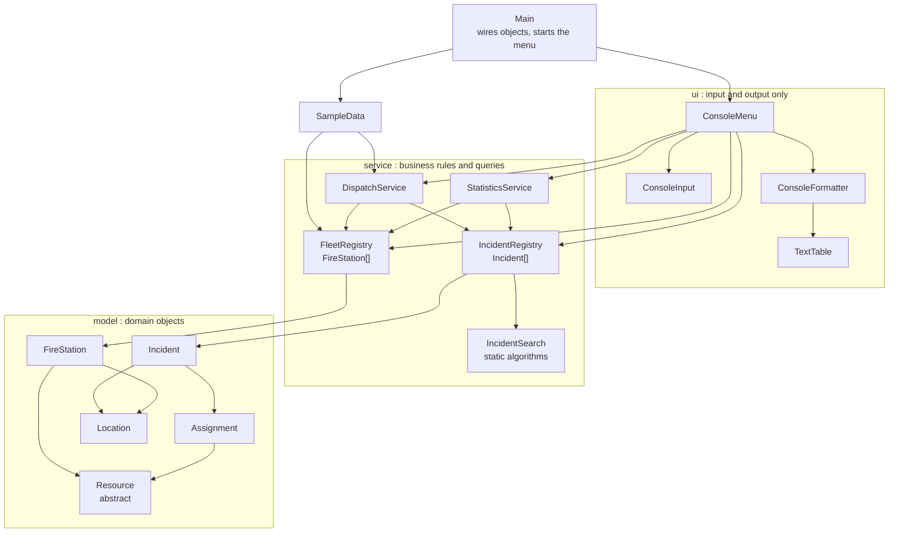
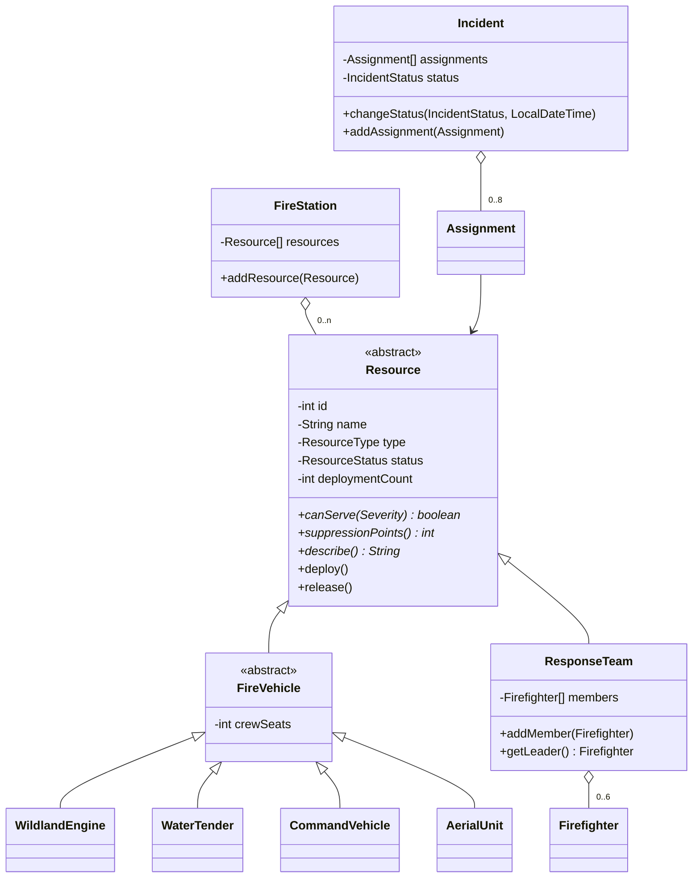

# CSC — Greek Fire Response Coordination System

**Ελληνικά** | [English](README.en.md)

Μια ολοκληρωμένη εκπαιδευτική εφαρμογή του **Computer Science Center (CSC)**.

Εκπαιδευτικός ιστότοπος: [https://csc.gr](https://csc.gr)

Υπεύθυνος: **Konstantinos Zitis**

| Πληροφορίες έργου | Τιμή |
| --- | --- |
| Repository | `csc-java-fire-response-system` |
| Κύρια περιοχή | Java |
| Επίπεδο μάθησης | Intermediate |
| Τεκμηριωμένη έκδοση | [v1.0.0](https://github.com/ConstantinSummer/csc-java-fire-response-system/releases/tag/v1.0.0) ([release notes](RELEASE_NOTES.md)) |

## Επισκόπηση έργου

Το **Greek Fire Response Coordination System** είναι μια εκτελέσιμη console εφαρμογή Java που μοντελοποιεί το πώς η Πυροσβεστική συντονίζει την ανταπόκρισή της σε δασικές πυρκαγιές στην Ελλάδα. Οι εκπαιδευόμενοι καταχωρίζουν συμβάντα δασικών πυρκαγιών, διαχειρίζονται πυροσβεστικούς σταθμούς και τους πόρους τους (οχήματα δασικών πυρκαγιών, βυτιοφόρα, οχήματα διοίκησης, ελικόπτερα, αεροσκάφη και ομάδες εδάφους), αναθέτουν πόρους σε συμβάντα με πραγματικούς επιχειρησιακούς κανόνες, μετακινούν τα συμβάντα στον κύκλο ζωής τους και διαβάζουν στατιστικά για τα συμβάντα και τη χρήση των πόρων.

Απευθύνεται σε εκπαιδευόμενους που γνωρίζουν ήδη τη βασική σύνταξη της Java και θέλουν να δουν πώς συνεργάζονται αντικείμενα, πίνακες και σαφείς αρμοδιότητες σε ένα πρόγραμμα μεγαλύτερο από μια μεμονωμένη άσκηση. Η εφαρμογή αποθηκεύει σκόπιμα τα πάντα σε **απλούς πίνακες με ρητή χωρητικότητα (capacity)** και όχι σε `ArrayList`, `HashMap`, streams ή βάση δεδομένων, ώστε οι δείκτες (indexes), τα όρια χωρητικότητας, η αναζήτηση και οι περιορισμοί των πινάκων να φαίνονται καθαρά στον κώδικα.

Υλοποιημένες λειτουργίες:

- Καταχώριση συμβάντος δασικής πυρκαγιάς με τοποθεσία, σοβαρότητα, ημερομηνία/ώρα και κατάσταση (επιλογή μενού 1).
- Εμφάνιση ενεργών συμβάντων, με το πιο σοβαρό πρώτο και την πρόοδο στελέχωσης (επιλογή 2), και πλήρεις λεπτομέρειες συμβάντος με το ιστορικό αναθέσεων (επιλογή 3).
- Ανάθεση πόρου σε συμβάν με έλεγχο κανόνων: ο πόρος πρέπει να είναι διαθέσιμος και κατάλληλος για τη σοβαρότητα του συμβάντος, το συμβάν πρέπει να είναι ανοιχτό και να έχει ελεύθερη θέση ανάθεσης (επιλογή 4).
- Αλλαγή κατάστασης συμβάντος μέσω ελεγχόμενης μηχανής καταστάσεων (state machine) (επιλογή 5).
- Εμφάνιση όλων των πόρων ή μόνο των διαθέσιμων, των αναπτυγμένων (deployed) ή των εκτός λειτουργίας σε όλους τους σταθμούς (επιλογή 6), και θέση ενός πόρου εκτός λειτουργίας ή επαναφορά του (επιλογή 7).
- Αναζήτηση και φιλτράρισμα συμβάντων: με id, με **γραμμική και δυαδική αναζήτηση δίπλα-δίπλα**, με περιφέρεια, ελάχιστη σοβαρότητα, κατάσταση και ελεύθερο κείμενο (επιλογή 8).
- Πρόταση του κοντινότερου διαθέσιμου και κατάλληλου πόρου συγκεκριμένου τύπου, με προαιρετική ανάθεση (επιλογή 9).
- Στατιστικά ανά σοβαρότητα, κατάσταση και περιφέρεια, μαζί με πίνακα περιφέρεια × σοβαρότητα (επιλογή 10), και στατιστικά χρήσης πόρων ανά τύπο και σταθμό, με τους πόρους που αναπτύσσονται συχνότερα (επιλογή 11).
- 14 προφορτωμένα συμβάντα, 10 σταθμοί και 38 πόροι, ώστε η εφαρμογή να είναι ενδιαφέρουσα από την πρώτη εκτέλεση.
- Το λανθασμένο input δεν τερματίζει ποτέ το πρόγραμμα· κάθε παραβίαση κανόνα αναφέρεται και το μενού συνεχίζει.
- 70 αυτοματοποιημένα tests (JUnit 5).

Εύρος και περιορισμοί: η βασική έκδοση είναι μια console εφαρμογή ενός χρήστη, με δεδομένα μόνο στη μνήμη. Τα δεδομένα δεν αποθηκεύονται μεταξύ εκτελέσεων και όλα τα συμβάντα, οι σταθμοί, τα οχήματα και τα πρόσωπα των δεδομένων δείγματος είναι **φανταστικά**· τα τοπωνύμια και οι συντεταγμένες είναι κατά προσέγγιση. Οι κανόνες αποστολής (π.χ. η κλίμακα «suppression points») είναι εκπαιδευτικές απλουστεύσεις και όχι πραγματικές διαδικασίες της Πυροσβεστικής. Όλο το output της κονσόλας είναι απλό ASCII, ώστε να εμφανίζεται σωστά σε κάθε τερματικό, συμπεριλαμβανομένης της προεπιλεγμένης κονσόλας των Windows.

### Ροή μάθησης

1. Κατεβάστε ή κάντε clone την τεκμηριωμένη έκδοση και ολοκληρώστε το setup.
2. Εκτελέστε την εφαρμογή και δοκιμάστε το παράδειγμα εκτέλεσης.
3. Μελετήστε τον πηγαίο κώδικα με τη βοήθεια των αναφορών αρχιτεκτονικής και εννοιών παρακάτω.
4. Συζητήστε τις σχεδιαστικές αποφάσεις και τις καθοδηγούμενες ερωτήσεις ανασκόπησης στα μαθήματα.
5. Ολοκληρώστε προκλήσεις επέκτασης και δείξτε ότι πληρούνται τα κριτήρια αποδοχής τους.

## Μαθησιακοί στόχοι

Μετά τη μελέτη και την επέκταση της εφαρμογής, οι εκπαιδευόμενοι πρέπει να μπορούν να:

- Εξηγούν πώς οι κλάσεις του [`model`](src/main/java/gr/csc/fireresponse/model) χρησιμοποιούν **encapsulation, constructors και validation** ώστε τα αντικείμενα να παραμένουν συνεπή (π.χ. [`Incident`](src/main/java/gr/csc/fireresponse/model/Incident.java) και [`Location`](src/main/java/gr/csc/fireresponse/model/Location.java)).
- Παρακολουθούν μια ιεραρχία κληρονομικότητας και προβλέπουν το αποτέλεσμα μιας **πολυμορφικής** κλήσης όπως `resource.canServe(severity)` για κάθε υποκλάση της [`Resource`](src/main/java/gr/csc/fireresponse/model/Resource.java).
- Δουλεύουν με **μονοδιάστατους και δισδιάστατους πίνακες**, εξηγώντας τη διαφορά ανάμεσα στη χωρητικότητα ενός πίνακα και στον αριθμό των θέσεων που χρησιμοποιούνται, και υλοποιούν δομή βασισμένη σε πίνακα που επιβάλλει όριο χωρητικότητας.
- Διαβάζουν και γράφουν **αλγορίθμους αναζήτησης, φιλτραρίσματος και ταξινόμησης** σε πίνακες (γραμμική αναζήτηση, δυαδική αναζήτηση, φιλτράρισμα δύο περασμάτων, insertion sort) και συγκρίνουν το κόστος τους με τους μετρητές συγκρίσεων που εμφανίζει η εφαρμογή.
- Διακρίνουν τα **checked exceptions** (παραβιάσεις επιχειρησιακών κανόνων) από τα **unchecked exceptions** (μη έγκυρα arguments) και δείχνουν πού το καθένα ρίπτεται και πού διαχειρίζεται.
- Μοντελοποιούν έναν κύκλο ζωής με **state machine βασισμένη σε enum** ([`IncidentStatus`](src/main/java/gr/csc/fireresponse/model/IncidentStatus.java)).
- Επιχειρηματολογούν για **cohesion, coupling και διαχωρισμό αρμοδιοτήτων**, αποφασίζοντας αν ένας κανόνας ανήκει στο model, σε ένα service ή στο UI της κονσόλας.
- Αξιολογούν τους **περιορισμούς των πινάκων** και περιγράφουν πώς θα άλλαζε ο σχεδιασμός για χιλιάδες συμβάντα και πόρους.
- Γράφουν στοχευμένα JUnit tests για έγκυρη και μη έγκυρη συμπεριφορά, χρησιμοποιώντας ένα injected `Clock` ώστε ο χρόνος να είναι προβλέψιμος.

## Προαπαιτούμενα

- Γνώσεις: σύνταξη Java, μεταβλητές, βρόχοι και συνθήκες, μέθοδοι και τα βασικά των κλάσεων και των αντικειμένων· δεν χρειάζεται να γνωρίζετε εκ των προτέρων collections, streams ή lambdas (λίγα μονογραμμικά lambdas εμφανίζονται στην [`IncidentSearch`](src/main/java/gr/csc/fireresponse/service/IncidentSearch.java) και στα tests και εξηγούνται στον κώδικα).
- Περιβάλλον: Windows, Linux ή macOS· Git· τερματικό· JDK 17 ή νεότερο· Apache Maven 3.6.3 ή νεότερο. Χρειάζεται πρόσβαση στο διαδίκτυο μία φορά, ώστε το Maven να κατεβάσει τα plugins και το JUnit.
- Εξωτερικοί πόροι: Κανένας. Δεν απαιτείται λογαριασμός, υπηρεσία, βάση δεδομένων, υλικό, dataset ή εργαλείο επί πληρωμή.

## Τεχνολογίες

| Τεχνολογία | Υποστηριζόμενη έκδοση | Ρόλος |
| --- | --- | --- |
| Java (JDK) | 17 ή νεότερη (μεταγλώττιση με `--release 17`) | Γλώσσα και runtime· στο runtime χρησιμοποιείται μόνο η standard library |
| Apache Maven | 3.6.3 ή νεότερο | Build, tests και packaging (`pom.xml`) |
| JUnit Jupiter (JUnit 5) | 5.10.2 | Αυτοματοποιημένα tests (μόνο test scope) |
| maven-compiler-plugin / surefire / jar | 3.13.0 / 3.2.5 / 3.4.1 | Μεταγλώττιση, εκτέλεση tests, δημιουργία εκτελέσιμου JAR |

Δεν υπάρχουν runtime εξαρτήσεις, βάση δεδομένων ή frameworks.

## Οδηγίες setup

1. Κάντε clone το repository και επιλέξτε την τεκμηριωμένη έκδοση:

   ```text
   git clone https://github.com/ConstantinSummer/csc-java-fire-response-system.git
   cd csc-java-fire-response-system
   git checkout v1.0.0
   ```

2. Δουλέψτε στη ρίζα του repository (ο φάκελος που περιέχει το `pom.xml`) για όλες τις παρακάτω εντολές.
3. Ελέγξτε τα εργαλεία. Το `java -version` πρέπει να δείχνει έκδοση 17 ή νεότερη και το `mvn -version` έκδοση 3.6.3 ή νεότερη:

   ```text
   java -version
   mvn -version
   ```

4. Δεν χρειάζεται ξεχωριστό βήμα εγκατάστασης εξαρτήσεων: το Maven κατεβάζει ό,τι χρειάζεται στο πρώτο build.
5. Δεν απαιτούνται ρυθμίσεις, μεταβλητές περιβάλλοντος ή μυστικά, ούτε προετοιμασία βάσης δεδομένων ή δεδομένων δείγματος: τα δεδομένα δείγματος δημιουργούνται στη μνήμη από την [`SampleData`](src/main/java/gr/csc/fireresponse/data/SampleData.java) κατά την εκκίνηση.
6. Επαληθεύστε το setup μεταγλωττίζοντας και τρέχοντας τα αυτοματοποιημένα tests:

   ```text
   mvn test
   ```

   Αναμενόμενο αποτέλεσμα: η σύνοψη περιέχει `Tests run: 70, Failures: 0, Errors: 0, Skipped: 0` και ακολουθεί `BUILD SUCCESS`.

## Οδηγίες εκτέλεσης

### Εκκίνηση και τερματισμός

Δημιουργήστε το εκτελέσιμο JAR και ξεκινήστε την εφαρμογή από τη ρίζα του repository:

```text
mvn package
java -jar target/csc-java-fire-response-system-1.0.0.jar
```

Η εφαρμογή εμφανίζει ένα αριθμημένο μενού και περιμένει input. Επιλέξτε `0` για έξοδο. Αν τελειώσει το input (Ctrl+D σε Linux/macOS, Ctrl+Z και μετά Enter σε Windows) εμφανίζει `Input ended. Goodbye.` και τερματίζει καθαρά.

Ένα προαιρετικό όρισμα «παγώνει» το ρολόι της εφαρμογής, ώστε το «τώρα» να είναι πάντα η ίδια χρονική στιγμή και μια συνεδρία να επαναλαμβάνεται ακριβώς:

```text
java -jar target/csc-java-fire-response-system-1.0.0.jar --now=2026-08-14T16:00
```

### Παράδειγμα εκτέλεσης

Το αρχείο [`docs/examples/demo-input.txt`](docs/examples/demo-input.txt) περιέχει όλες τις απαντήσεις που πληκτρολογήθηκαν στην καταγεγραμμένη συνεδρία παρακάτω: εμφανίζει τα συμβάντα, κάνει ένα σκόπιμο λάθος στο input, καταχωρίζει νέο συμβάν στην Πελοπόννησο, ζητά το κοντινότερο διαθέσιμο όχημα, επιχειρεί μη έγκυρη ανάθεση, αναθέτει ένα βυτιοφόρο, επιχειρεί μη έγκυρη αλλαγή κατάστασης, αλλάζει σωστά την κατάσταση, εμφανίζει τις λεπτομέρειες του συμβάντος, συγκρίνει γραμμική και δυαδική αναζήτηση, κάνει αναζήτηση κειμένου και εκτυπώνει τις αναφορές στατιστικών και χρήσης πόρων.

Επαναλάβετέ την με παγωμένο ρολόι (Linux, macOS, Git Bash ή Windows `cmd`):

```text
java -jar target/csc-java-fire-response-system-1.0.0.jar --now=2026-08-14T16:00 < docs/examples/demo-input.txt
```

Στο Windows PowerShell, που δεν υποστηρίζει το `<`, χρησιμοποιήστε:

```text
Get-Content docs/examples/demo-input.txt | java -jar target/csc-java-fire-response-system-1.0.0.jar --now=2026-08-14T16:00
```

Το αποτέλεσμα είναι το ίδιο με την καταγεγραμμένη συνεδρία, με τη διαφορά ότι ένα τερματικό εμφανίζει τους χαρακτήρες που πληκτρολογείτε, ενώ μια επανάληψη από αρχείο δεν τους εμφανίζει.

**Καταγεγραμμένη συνεδρία** (πραγματικό output της εφαρμογής· το `[...]` σημαίνει ότι παραλείπονται γραμμές από το απόσπασμα). Ολόκληρη η συνεδρία βρίσκεται στο [`docs/examples/demo-session.txt`](docs/examples/demo-session.txt).

Εκκίνηση, μενού και λίστα ενεργών συμβάντων (επιλογή μενού 2):

```text
===========================================
  Greek Fire Response Coordination System
===========================================
CSC - Computer Science Center | https://csc.gr | Educational sample data, not real incidents

MAIN MENU
   1. Report a new wildfire incident
   2. List active incidents
   3. Show incident details
   4. Assign a resource to an incident
   5. Change incident status
   6. Show fire service resources
   7. Set a resource out of service / return it to service
   8. Search and filter incidents
   9. Suggest the nearest available resource
  10. Statistics (severity / status / region)
  11. Resource utilisation
   0. Exit
Choose an option (0-11): 2

========================================
  Active incidents (most severe first)
========================================
+----+------------------+----------------+--------------------+----------+------------+-----------+---------+
| ID | Reported         | Region         | Area               | Severity | Status     | Resources | Points  |
+----+------------------+----------------+--------------------+----------+------------+-----------+---------+
|  3 | 2026-07-18 09:40 | Central Greece | Prokopi, Evia      | Critical | Active     |         6 | 187/200 |
| 12 | 2026-08-05 13:00 | Western Greece | Ancient Olympia    | Critical | Active     |         5 | 161/200 |
|  1 | 2026-07-15 13:20 | Attica         | Marathon foothills | High     | Active     |         3 |  86/120 |
|  4 | 2026-07-20 14:10 | Peloponnese    | Taygetos foothills | High     | Responding |         2 |  58/120 |
| 11 | 2026-08-03 16:20 | North Aegean   | Mytilene hills     | High     | Reported   |         0 |   0/120 |
|  2 | 2026-07-15 16:05 | Attica         | Penteli            | Moderate | Contained  |         3 |   84/60 |
|  6 | 2026-07-24 15:45 | South Aegean   | Laerma             | Moderate | Active     |         2 |   45/60 |
| 10 | 2026-08-02 12:30 | Ionian Islands | Pantokrator        | Moderate | Reported   |         0 |    0/60 |
|  5 | 2026-07-22 11:30 | Crete          | Apokoronas         | Low      | Reported   |         0 |    0/20 |
+----+------------------+----------------+--------------------+----------+------------+-----------+---------+
9 active of 14 recorded incidents (registry capacity 60). Points = assigned / recommended.
```

Το λάθος input απορρίπτεται και το μενού συνεχίζει (input `abc`)· καταχωρίζεται νέο συμβάν με επικυρωμένα πεδία:

```text
Choose an option (0-11): abc
  ! Please enter a whole number between 0 and 11.
Choose an option (0-11): 1
Description: Brush fire near olive groves above Molaoi
Region:
[...]
Choose 1-13: 3
Area / locality: Molaoi
Latitude (34.5 to 42.0): 36.81
Longitude (19.0 to 29.9): 22.86
Severity:
  1. Low
  2. Moderate
  3. High
  4. Critical
Choose 1-4: 3
Reported at (yyyy-MM-dd HH:mm, Enter = now): 
Incident #15 reported (High, Molaoi, Peloponnese). Status: Reported.
```

Οι επιχειρησιακοί κανόνες σε δράση: ένας μη διαθέσιμος πόρος απορρίπτεται, μια έγκυρη ανάθεση πετυχαίνει και μια μη νόμιμη αλλαγή κατάστασης απορρίπτεται:

```text
Incident id: 15
[...]
Resource id to assign: 1
  ! ATT-E1 is not available (status: Deployed)
[...]
Resource id to assign: 30
THE-WT1 assigned to incident #15. Resourcing is now 75 of 120 recommended points.
[...]
Incident id: 15
Current status: Reported
Allowed next statuses: Responding, False alarm
New status:
Choose 1-6: 3
  ! Cannot change status from Reported to Active
```

Οι λεπτομέρειες συμβάντος δείχνουν το ιστορικό αναθέσεων και τη στελέχωση σε σχέση με τους προτεινόμενους πόντους· το μενού αναζήτησης αποκαλύπτει το κόστος δύο αλγορίθμων:

```text
Incident id: 15
Incident #15: Brush fire near olive groves above Molaoi
  Location     : Molaoi, Peloponnese (36.810, 22.860)
  Severity     : High
  Status       : Responding
  Reported     : 2026-08-14 16:00
  Last update  : 2026-08-14 16:00
  Resourcing   : 75 of 120 recommended points (insufficient)
  Assignments  : 2 of 8 slots used
+----------+-----------------+---------------------------+------------------+----------+
| Resource | Type            | Station                   | Assigned         | Released |
+----------+-----------------+---------------------------+------------------+----------+
| CHN-E1   | Wildland engine | Chania Station            | 2026-08-14 16:00 | -        |
| THE-WT1  | Water tender    | Thessaloniki East Station | 2026-08-14 16:00 | -        |
+----------+-----------------+---------------------------+------------------+----------+
[...]
Search:
  1. By id (linear vs binary search)
  2. By region
  3. By minimum severity
  4. By status
  5. By text in description / area
Choose 1-5: 1
Incident id: 14
Linear search: found at index 13 after 14 comparisons
Binary search: found at index 13 after 3 comparisons
+----+------------------+-------------------+--------------+----------+-------------+-----------+--------+
| ID | Reported         | Region            | Area         | Severity | Status      | Resources | Points |
+----+------------------+-------------------+--------------+----------+-------------+-----------+--------+
| 14 | 2026-08-06 09:10 | Western Macedonia | Kozani plain | Moderate | False alarm |         0 |   0/60 |
+----+------------------+-------------------+--------------+----------+-------------+-----------+--------+
1 incident matches (most severe first).
```

### Επαλήθευση συμπεριφοράς

Τρέξτε τα αυτοματοποιημένα tests (`mvn test`). Είναι οργανωμένα γύρω από τη συμπεριφορά που πρέπει να εγγυάται η εφαρμογή:

| Test class | Tests | Τι επαληθεύει |
| --- | --- | --- |
| [`AssignmentTest`](src/test/java/gr/csc/fireresponse/service/AssignmentTest.java) | 10 | Έγκυρη ανάθεση· μη έγκυρη ανάθεση (μη διαθέσιμος πόρος, κλειστό συμβάν, εκτός λειτουργίας, ακατάλληλη σοβαρότητα, υποστελεχωμένη ομάδα, άγνωστα ids)· οι αποτυχημένες αναθέσεις δεν αφήνουν παρενέργειες |
| [`CapacityTest`](src/test/java/gr/csc/fireresponse/service/CapacityTest.java) | 7 | Όρια χωρητικότητας αναθέσεων συμβάντος, σταθμών, ομάδων και των δύο registries· αναλλοίωτη ταξινόμηση των ids |
| [`StatusTransitionTest`](src/test/java/gr/csc/fireresponse/service/StatusTransitionTest.java) | 8 | Πλήρης κύκλος ζωής, αναζωπύρωση, μη νόμιμες μεταβάσεις, τελικές καταστάσεις, ο κανόνας «χρειάζεται πόρο», αποδέσμευση πόρων στο κλείσιμο |
| [`StatisticsTest`](src/test/java/gr/csc/fireresponse/service/StatisticsTest.java) | 8 | Μετρήσεις ανά σοβαρότητα, κατάσταση και περιφέρεια, ο 2D πίνακας, χρήση πόρων, κατάταξη των πιο απασχολημένων πόρων |
| [`IncidentSearchTest`](src/test/java/gr/csc/fireresponse/service/IncidentSearchTest.java) | 11 | Γραμμική και δυαδική αναζήτηση (με μετρητές συγκρίσεων), φίλτρα, αναζήτηση κειμένου, insertion sort |
| [`DomainModelTest`](src/test/java/gr/csc/fireresponse/model/DomainModelTest.java) | 13 | Validation, πολυμορφικός πίνακας `canServe`, suppression points, αρχηγός ομάδας, overloads |
| [`SampleDataTest`](src/test/java/gr/csc/fireresponse/data/SampleDataTest.java) | 4 | Τα προφορτωμένα δεδομένα είναι συνεπή με τις καταστάσεις των συμβάντων |
| [`ConsoleMenuTest`](src/test/java/gr/csc/fireresponse/ui/ConsoleMenuTest.java) | 9 | Σενάρια κονσόλας με προκαθορισμένο input: το λάθος input δεν τερματίζει ποτέ το πρόγραμμα |

Για χειροκίνητη επαλήθευση, επαναλάβετε την καταγεγραμμένη συνεδρία όπως περιγράφεται παραπάνω και συγκρίνετε το output με το [`docs/examples/demo-session.txt`](docs/examples/demo-session.txt).

### Αντιμετώπιση προβλημάτων

| Σύμπτωμα | Πιθανή αιτία | Λύση |
| --- | --- | --- |
| Το `mvn` ή το `java` δεν αναγνωρίζεται | Το εργαλείο δεν είναι εγκατεστημένο ή δεν βρίσκεται στο `PATH` | Εγκαταστήστε JDK 17+ και Maven 3.6.3+, ανοίξτε νέο τερματικό και επαναλάβετε τα `java -version` και `mvn -version` |
| `release version 17 not supported` ή `invalid target release: 17` | Το Maven χρησιμοποιεί JDK παλαιότερο του 17 | Ορίστε το `JAVA_HOME` σε εγκατάσταση JDK 17+ και ελέγξτε ότι το `mvn -version` δείχνει αυτό το JDK |
| `Unable to access jarfile target/...jar` | Το JAR δεν έχει δημιουργηθεί ή η εντολή τρέχει εκτός της ρίζας του repository | Τρέξτε `mvn package` στον φάκελο που περιέχει το `pom.xml` |
| Το Maven δεν κατεβάζει plugins ή JUnit | Δεν υπάρχει πρόσβαση στο διαδίκτυο ή proxy/firewall μπλοκάρει το Maven Central | Συνδεθείτε στο διαδίκτυο ή ρυθμίστε το proxy στο `settings.xml` του Maven |
| Το πρόγραμμα εμφανίζει αμέσως `Input ended. Goodbye.` | Το standard input είναι κενό ή έχει ήδη κλείσει (π.χ. κενό αρχείο ανακατεύθυνσης) | Τρέξτε το διαδραστικά ή ανακατευθύνετε αρχείο που περιέχει απαντήσεις |
| `Invalid --now value` | Το όρισμα ρολογιού δεν είναι ημερομηνία-ώρα ISO | Χρησιμοποιήστε τη μορφή `--now=2026-08-14T16:00` |

## Αρχιτεκτονική / δομή project

```text
csc-java-fire-response-system/
|-- docs/examples/
|   |-- demo-input.txt
|   `-- demo-session.txt
|-- src/
|   |-- main/java/gr/csc/fireresponse/
|   |   |-- data/
|   |   |   `-- SampleData.java
|   |   |-- exception/
|   |   |   |-- CapacityExceededException.java
|   |   |   |-- FireResponseException.java
|   |   |   |-- InvalidAssignmentException.java
|   |   |   |-- InvalidResourceStateException.java
|   |   |   |-- InvalidStatusTransitionException.java
|   |   |   `-- NotFoundException.java
|   |   |-- model/
|   |   |   |-- AerialUnit.java
|   |   |   |-- Assignment.java
|   |   |   |-- CommandVehicle.java
|   |   |   |-- Firefighter.java
|   |   |   |-- FireStation.java
|   |   |   |-- FireVehicle.java
|   |   |   |-- Incident.java
|   |   |   |-- IncidentStatus.java
|   |   |   |-- Location.java
|   |   |   |-- Rank.java
|   |   |   |-- Region.java
|   |   |   |-- Resource.java
|   |   |   |-- ResourceStatus.java
|   |   |   |-- ResourceType.java
|   |   |   |-- ResponseTeam.java
|   |   |   |-- Severity.java
|   |   |   |-- WaterTender.java
|   |   |   `-- WildlandEngine.java
|   |   |-- service/
|   |   |   |-- DispatchService.java
|   |   |   |-- FleetRegistry.java
|   |   |   |-- IncidentRegistry.java
|   |   |   |-- IncidentSearch.java
|   |   |   |-- SearchResult.java
|   |   |   |-- StatisticsService.java
|   |   |   `-- Utilisation.java
|   |   |-- ui/
|   |   |   |-- ConsoleFormatter.java
|   |   |   |-- ConsoleInput.java
|   |   |   |-- ConsoleMenu.java
|   |   |   |-- InputEndedException.java
|   |   |   `-- TextTable.java
|   |   |-- util/
|   |   |   `-- Validate.java
|   |   `-- Main.java
|   `-- test/java/gr/csc/fireresponse/
|       |-- data/
|       |   `-- SampleDataTest.java
|       |-- model/
|       |   `-- DomainModelTest.java
|       |-- service/
|       |   |-- AssignmentTest.java
|       |   |-- CapacityTest.java
|       |   |-- IncidentSearchTest.java
|       |   |-- StatisticsTest.java
|       |   `-- StatusTransitionTest.java
|       |-- ui/
|       |   `-- ConsoleMenuTest.java
|       `-- Scenario.java
|-- .gitattributes
|-- .gitignore
|-- LICENSE
|-- pom.xml
|-- README.en.md
|-- README.md
`-- RELEASE_NOTES.md
```

| Component / διαδρομή πηγαίου | Αρμοδιότητα |
| --- | --- |
| [`Main`](src/main/java/gr/csc/fireresponse/Main.java) | Σημείο εισόδου: δημιουργεί τα registries και τα services, φορτώνει τα δεδομένα δείγματος, ξεκινά το μενού. Δεν περιέχει κανόνες. |
| [`model/`](src/main/java/gr/csc/fireresponse/model) | Αντικείμενα του domain και οι κανόνες που αφορούν ένα μεμονωμένο αντικείμενο: [`Incident`](src/main/java/gr/csc/fireresponse/model/Incident.java), [`Assignment`](src/main/java/gr/csc/fireresponse/model/Assignment.java), [`FireStation`](src/main/java/gr/csc/fireresponse/model/FireStation.java), [`Location`](src/main/java/gr/csc/fireresponse/model/Location.java), [`Firefighter`](src/main/java/gr/csc/fireresponse/model/Firefighter.java), η ιεραρχία `Resource` και τα enums. |
| [`model/Resource`](src/main/java/gr/csc/fireresponse/model/Resource.java) και υποκλάσεις | Αφηρημένη βάση για ό,τι μπορεί να ανατεθεί, με την [`ResponseTeam`](src/main/java/gr/csc/fireresponse/model/ResponseTeam.java), την αφηρημένη [`FireVehicle`](src/main/java/gr/csc/fireresponse/model/FireVehicle.java) και τα τέσσερα συγκεκριμένα είδη της ([`WildlandEngine`](src/main/java/gr/csc/fireresponse/model/WildlandEngine.java), [`WaterTender`](src/main/java/gr/csc/fireresponse/model/WaterTender.java), [`CommandVehicle`](src/main/java/gr/csc/fireresponse/model/CommandVehicle.java), [`AerialUnit`](src/main/java/gr/csc/fireresponse/model/AerialUnit.java)). |
| [`service/DispatchService`](src/main/java/gr/csc/fireresponse/service/DispatchService.java) | Κανόνες που αφορούν πολλά αντικείμενα: καταχώριση, ανάθεση, αλλαγές κατάστασης (συμπεριλαμβανομένης της αποδέσμευσης πόρων), αλλαγές διαθεσιμότητας. |
| [`service/IncidentRegistry`](src/main/java/gr/csc/fireresponse/service/IncidentRegistry.java), [`FleetRegistry`](src/main/java/gr/csc/fireresponse/service/FleetRegistry.java) | Αποθήκευση σε πίνακες σταθερής χωρητικότητας, παραγωγή ids και αναζητήσεις. |
| [`service/IncidentSearch`](src/main/java/gr/csc/fireresponse/service/IncidentSearch.java) | Οι αλγόριθμοι αναζήτησης, φιλτραρίσματος και ταξινόμησης, γραμμένοι ρητά πάνω σε πίνακες. |
| [`service/StatisticsService`](src/main/java/gr/csc/fireresponse/service/StatisticsService.java) | Μετρήσεις μόνο για ανάγνωση, ο πίνακας περιφέρεια × σοβαρότητα και η χρήση πόρων. |
| [`exception/`](src/main/java/gr/csc/fireresponse/exception) | Η ιεραρχία checked exceptions για παραβιάσεις επιχειρησιακών κανόνων. |
| [`ui/`](src/main/java/gr/csc/fireresponse/ui) | [`ConsoleMenu`](src/main/java/gr/csc/fireresponse/ui/ConsoleMenu.java) (βρόχος μενού), [`ConsoleInput`](src/main/java/gr/csc/fireresponse/ui/ConsoleInput.java) (επικυρωμένο input), [`ConsoleFormatter`](src/main/java/gr/csc/fireresponse/ui/ConsoleFormatter.java) και [`TextTable`](src/main/java/gr/csc/fireresponse/ui/TextTable.java) (output). |
| [`data/SampleData`](src/main/java/gr/csc/fireresponse/data/SampleData.java) | Προφορτωμένο σενάριο, που δημιουργείται μέσω των ίδιων services και κανόνων με το input του χρήστη. |
| [`util/Validate`](src/main/java/gr/csc/fireresponse/util/Validate.java) | Μικροί static έλεγχοι arguments που χρησιμοποιούν οι constructors. |

**Διάγραμμα αρχιτεκτονικής**



**Η ιεραρχία κλάσεων των πόρων και οι βασικές συνθέσεις (compositions)**



Σημείο εισόδου και ροή δεδομένων: η `Main.main` δημιουργεί τα αντικείμενα και καλεί την `ConsoleMenu.run()`. Πάρτε ως αντιπροσωπευτική λειτουργία την επιλογή 4 του μενού (ανάθεση πόρου): η `ConsoleMenu.assignResource()` ζητά id συμβάντος και βρίσκει το συμβάν με την `IncidentRegistry.findById` (δυαδική αναζήτηση), εκτυπώνει τους διαθέσιμους πόρους από την `FleetRegistry.resourcesWithStatus`, διαβάζει id πόρου και το επιλύει με την `FleetRegistry.findResourceById`. Στη συνέχεια καλεί την `DispatchService.assign(incident, resource)`, η οποία ελέγχει ότι το συμβάν είναι ανοιχτό, ότι ο πόρος είναι διαθέσιμος και κατάλληλος (`Resource.canServe`, πολυμορφική κλήση) και ότι το συμβάν έχει ελεύθερη θέση, και μόνο τότε καλεί τις `Resource.deploy()` και `Incident.addAssignment(...)`. Οι παραβιάσεις κανόνων ρίπτονται ως checked exceptions και πιάνονται στην `ConsoleMenu.handle`, που εκτυπώνει το μήνυμα και επιστρέφει στο μενού· σε επιτυχία το μενού εκτυπώνει το νέο σύνολο στελέχωσης.

Σχεδιαστικές αποφάσεις και trade-offs:

- **Πίνακες αντί για collections.** Κάθε συλλογή είναι ένας πίνακας μαζί με έναν μετρητή (`IncidentRegistry`, `FireStation`, `ResponseTeam`, `Incident`). Έτσι αναδεικνύονται η χωρητικότητα, οι δείκτες και η μετατόπιση στοιχείων, με κόστος τα σταθερά μεγέθη και κάποιους επαναλαμβανόμενους βρόχους. Οι προκλήσεις παρακάτω ζητούν να αλλάξετε ακριβώς αυτούς τους περιορισμούς.
- **Ταξινομημένος πίνακας + δυαδική αναζήτηση.** Το `IncidentRegistry` δέχεται μόνο το επόμενο id, οπότε ο πίνακας είναι πάντα ταξινομημένος ως προς το id και η `findById` μπορεί να χρησιμοποιεί δυαδική αναζήτηση. Το κόστος είναι ότι η διαγραφή ενός συμβάντος θα απαιτούσε μετατόπιση στοιχείων (πρόκληση 1).
- **Κληρονομικότητα όπου υπάρχει πραγματικό «is-a» και πολυμορφισμός.** Όλοι οι πόροι μπορούν να αναπτυχθούν (deploy), να αποδεσμευτούν και να ερωτηθούν `canServe`, `suppressionPoints` και `describe`, αλλά ο καθένας απαντά διαφορετικά. Η σύνθεση (composition) χρησιμοποιείται για σχέσεις «has-a»: ένα συμβάν έχει αναθέσεις, ένας σταθμός έχει πόρους, μια ομάδα έχει πυροσβέστες. Ο πυροσβέστης σκόπιμα δεν είναι `Resource`.
- **Το enum `ResourceType` μαζί με τις υποκλάσεις.** Οι υποκλάσεις φέρουν συμπεριφορά και δεδομένα· το enum δίνει στα στατιστικά και στις αναζητήσεις μία σταθερή ετικέτα για ομαδοποίηση. Η `AerialUnit` καλύπτει δύο τύπους με μία κλάση, ενώ κάθε επίγειο όχημα έχει τη δική του κλάση: ένα trade-off προς συζήτηση.
- **Πού ζει ένας κανόνας.** Ένας κανόνας για ένα αντικείμενο μένει σε αυτό το αντικείμενο (`IncidentStatus.canTransitionTo`, `Resource.deploy`, έλεγχοι χωρητικότητας)· ένας κανόνας που χρειάζεται πολλά αντικείμενα ζει στο `DispatchService` (ανάθεση, «το responding χρειάζεται πόρο»). Η κονσόλα απλώς καλεί τα services.
- **Checked και unchecked exceptions.** Οι παραβιάσεις επιχειρησιακών κανόνων επεκτείνουν το checked `FireResponseException`· τα μη έγκυρα arguments των constructors ρίπτουν `IllegalArgumentException`. Η `ConsoleMenu.handle` πιάνει και τα δύο και δεν καταρρέει ποτέ.
- **Static μέθοδοι μόνο όπου έχουν νόημα.** Οι `Validate` και `IncidentSearch` είναι χωρίς κατάσταση (stateless) σύνολα καθαρών συναρτήσεων· ό,τι έχει κατάσταση είναι instance.
- **Injected `Clock`.** Τα services δεν καλούν ποτέ απευθείας την ώρα του συστήματος, οπότε τα tests και η καταγεγραμμένη συνεδρία χρησιμοποιούν σταθερή ώρα.
- **Γνωστές απλουστεύσεις.** Οι αποδεσμευμένες αναθέσεις εξακολουθούν να καταλαμβάνουν θέση στον πίνακα του συμβάντος (το ιστορικό διατηρείται)· τα ids πόρων αναζητούνται με σάρωση· η χρήση πόρων εξαιρεί τους πόρους εκτός λειτουργίας· η κλίμακα «suppression points» είναι επινοημένη για διδασκαλία.

## Έννοιες προς αναγνώριση και συζήτηση

| Έννοια | Αναφορά στον κώδικα | Θέμα συζήτησης |
| --- | --- | --- |
| Κλάσεις, αντικείμενα και encapsulation | [`Incident`](src/main/java/gr/csc/fireresponse/model/Incident.java): private πεδία, `changeStatus`, `addAssignment` | Ποια πεδία είναι `final` και γιατί; Γιατί κανένας εξωτερικός κώδικας δεν μπορεί να αλλάξει την κατάσταση χωρίς τη state machine; |
| Constructors, chaining και validation | [`Firefighter`](src/main/java/gr/csc/fireresponse/model/Firefighter.java), [`Location`](src/main/java/gr/csc/fireresponse/model/Location.java), [`Validate`](src/main/java/gr/csc/fireresponse/util/Validate.java) | Τι εγγυάται ένα αντικείμενο αφού επιστρέψει ο constructor του; |
| Instance μέθοδοι | [`Resource.deploy`](src/main/java/gr/csc/fireresponse/model/Resource.java), `Incident.getAssignedPoints` | Ποιες μέθοδοι αλλάζουν κατάσταση και ποιες μόνο απαντούν σε ερωτήσεις; |
| Static μέθοδοι με σκοπό | [`Validate`](src/main/java/gr/csc/fireresponse/util/Validate.java), [`IncidentSearch`](src/main/java/gr/csc/fireresponse/service/IncidentSearch.java) | Γιατί αυτές είναι static ενώ το `DispatchService` όχι; |
| Method overloading | [`Location.distanceKmTo`](src/main/java/gr/csc/fireresponse/model/Location.java), [`DispatchService.assign`](src/main/java/gr/csc/fireresponse/service/DispatchService.java), [`FleetRegistry.findNearestAvailable`](src/main/java/gr/csc/fireresponse/service/FleetRegistry.java) | Πώς επιλέγει η Java ανάμεσα στα overloads; Τι θα χαλούσε αν δύο overloads είχαν ίδιους τύπους παραμέτρων; |
| Παράμετροι και τιμές επιστροφής | [`SearchResult`](src/main/java/gr/csc/fireresponse/service/SearchResult.java) που επιστρέφει η `IncidentSearch.binarySearchById` | Γιατί να επιστραφεί αντικείμενο με δύο τιμές και όχι μόνο ο δείκτης; |
| Μονοδιάστατοι πίνακες, capacity και count | [`IncidentRegistry`](src/main/java/gr/csc/fireresponse/service/IncidentRegistry.java), [`FireStation`](src/main/java/gr/csc/fireresponse/model/FireStation.java), `StatisticsService.countBySeverity` | Ποια η διαφορά ανάμεσα στο `array.length` και στο `count`; Πού μπορεί να διαφέρουν; |
| Δισδιάστατοι πίνακες | [`StatisticsService.countByRegionAndSeverity`](src/main/java/gr/csc/fireresponse/service/StatisticsService.java) | Γιατί ένας 2D πίνακας είναι φυσική επιλογή εδώ; Τι σημαίνουν οι δείκτες γραμμής και στήλης; |
| Σύνθεση (composition) | `Incident` → `Assignment[]` → `Resource`· `FireStation` → `Resource[]`· [`ResponseTeam`](src/main/java/gr/csc/fireresponse/model/ResponseTeam.java) → `Firefighter[]` | Ποιος κατέχει ποιον; Τι συμβαίνει σε μια ανάθεση όταν κλείσει το συμβάν; |
| Κληρονομικότητα | [`Resource`](src/main/java/gr/csc/fireresponse/model/Resource.java) → [`FireVehicle`](src/main/java/gr/csc/fireresponse/model/FireVehicle.java) → [`WildlandEngine`](src/main/java/gr/csc/fireresponse/model/WildlandEngine.java) και αδελφές κλάσεις | Τι προσθέτει κάθε επίπεδο; Θα κρατούσατε τη `FireVehicle`; |
| Πολυμορφισμός | Η `Incident.getAssignedPoints` καλεί `suppressionPoints()`· η `DispatchService.assign` καλεί `canServe(...)` | Ποιο `if`/`switch` πάνω στον τύπο του πόρου θα χρειαζόταν χωρίς πολυμορφισμό; |
| Enums με συμπεριφορά | [`IncidentStatus.allowedNext`](src/main/java/gr/csc/fireresponse/model/IncidentStatus.java), [`Severity`](src/main/java/gr/csc/fireresponse/model/Severity.java) | Ποια τα οφέλη ενός enum έναντι ακέραιων σταθερών σε μια state machine; |
| Validation | Constructors, [`ConsoleInput.readInt`](src/main/java/gr/csc/fireresponse/ui/ConsoleInput.java) | Σε ποια επίπεδα επικυρώνεται το input και γιατί περισσότερες από μία φορές; |
| Διαχείριση exceptions | Ιεραρχία [`FireResponseException`](src/main/java/gr/csc/fireresponse/exception/FireResponseException.java), `ConsoleMenu.handle` | Γιατί η παραβίαση κανόνα είναι checked ενώ ένα `null` argument unchecked; |
| Αναζήτηση και ταξινόμηση | [`IncidentSearch`](src/main/java/gr/csc/fireresponse/service/IncidentSearch.java) | Πότε είναι καλύτερη η γραμμική αναζήτηση; Τι κοστίζει το insertion sort σε 1.000 συμβάντα; |
| Διαχωρισμός αρμοδιοτήτων | `ConsoleMenu` έναντι [`DispatchService`](src/main/java/gr/csc/fireresponse/service/DispatchService.java) | Θα μπορούσατε να αντικαταστήσετε την κονσόλα με web UI χωρίς να αγγίξετε τους κανόνες; |
| Dependency injection | `Clock` στο [`DispatchService`](src/main/java/gr/csc/fireresponse/service/DispatchService.java) και [`Main.createClock`](src/main/java/gr/csc/fireresponse/Main.java) | Πώς κάνει το injection του ρολογιού εφικτά τα tests; |

## Καθοδηγούμενες ερωτήσεις ανασκόπησης

1. Ακολουθήστε την επιλογή 4 του μενού από την `ConsoleMenu.assignResource` μέχρι την `Resource.deploy`. Καταγράψτε με τη σειρά τις κλάσεις που εμπλέκονται και πείτε ποια αποφασίζει ότι μια ανάθεση επιτρέπεται.
2. Η `DispatchService.assign` κάνει όλους τους ελέγχους *πριν* καλέσει το `resource.deploy()`. Ποια κατάσταση θα έμενε ασυνεπής αν το deploy γινόταν πρώτο και ο έλεγχος χωρητικότητας του συμβάντος αποτύγχανε μετά; Ποιο test το προστατεύει;
3. Το `IncidentStatus.canTransitionTo` και ο κανόνας «το responding χρειάζεται τουλάχιστον έναν πόρο» επιβάλλονται σε διαφορετικές κλάσεις. Γιατί ο καθένας ανήκει εκεί που βρίσκεται;
4. Οι αποδεσμευμένες αναθέσεις εξακολουθούν να καταλαμβάνουν μία από τις οκτώ θέσεις ενός `Incident`. Τι πρόβλημα μπορεί να προκαλέσει αυτό σε ένα μακρύ συμβάν και πώς θα αλλάζατε τον σχεδιασμό;
5. Το `IncidentRegistry.add` απορρίπτει κάθε id εκτός από το `nextId()`. Ποιος αλγόριθμος εξαρτάται από αυτόν τον κανόνα και τι θα συνέβαινε σε αυτόν αν τα ids μπορούσαν να προστεθούν με τυχαία σειρά;
6. Τρέξτε την αναζήτηση με id για το συμβάν 14 και σημειώστε τους μετρητές συγκρίσεων. Προβλέψτε τους μετρητές για την ίδια αναζήτηση με 60 και με 1.000 συμβάντα και ελέγξτε την πρόβλεψή σας με τους αλγορίθμους της `IncidentSearch`.
7. Βρείτε τρία σημεία όπου μια πολυμορφική κλήση αντικαθιστά αλυσίδα `if`/`switch`. Τι θα έπρεπε να αλλάξει στον υπάρχοντα κώδικα αν προστίθετο ένα νέο είδος πόρου;
8. Η `AerialUnit` καλύπτει ελικόπτερα και αεροσκάφη με μία κλάση, ενώ τα οχήματα και τα βυτιοφόρα έχουν ξεχωριστές κλάσεις. Ποια τα πλεονεκτήματα και οι κίνδυνοι κάθε προσέγγισης;
9. Η `ResponseTeam.canServe` αγνοεί τη σοβαρότητα και εξαρτάται από τον αριθμό των μελών της ομάδας. Γιατί δύο αντικείμενα της ίδιας κλάσης μπορούν να δώσουν διαφορετική απάντηση και πού δοκιμάζεται ο κανόνας;
10. Ποια exceptions του project είναι checked και ποια unchecked; Εξηγήστε την επιλογή για το `CapacityExceededException` και για το `IllegalArgumentException` που ρίπτει η `Location`.
11. Η `Location` είναι immutable, ενώ το `Incident` μπορεί να αλλάξει. Τι κερδίζει η `Location` από την αμεταβλητότητα και ποια πεδία του `Incident` παραμένουν `final`;
12. Το `StatisticsService` δεικτοδοτεί τους πίνακές του με `ordinal()`. Τι θα μπορούσε να πάει στραβά αν άλλαζε η σειρά των σταθερών του enum και τι εναλλακτικές υπάρχουν;
13. Η χρήση πόρων υπολογίζεται ως προς τους πόρους *σε λειτουργία*. Υπολογίστε ξανά τη συνολική χρήση από τα δεδομένα δείγματος με και χωρίς αυτόν τον κανόνα (δείτε την επιλογή 11) και εξηγήστε τη διαφορά.
14. Ένας πόρος βρίσκεται με σάρωση όλων των σταθμών. Εκτιμήστε τον όγκο εργασίας για 50.000 πόρους και εξηγήστε πώς θα άλλαζε ο σχεδιασμός για χιλιάδες συμβάντα και πόρους (π.χ. ευρετήρια, ταξινομημένοι πίνακες ή hashing).
15. Η εφαρμογή δεν αλλάζει ποτέ τη σοβαρότητα ενός συμβάντος. Αν η σοβαρότητα μπορούσε να μειωθεί ενώ ένα αεροσκάφος είναι ανατεθειμένο στο συμβάν, ποιος κανόνας του συστήματος θα παραβιαζόταν και σε ποια κλάση θα τον ελέγχατε;

## Προκλήσεις επέκτασης

Η τεκμηριωμένη έκδοση είναι η βασική λειτουργική έκδοση. Οι παρακάτω λειτουργίες είναι επεκτάσεις των εκπαιδευομένων: καμία δεν υπάρχει στον κώδικα.

### Πρόκληση 1: Αρχειοθέτηση συμβάντος (διαγραφή από πίνακα)

- Δυσκολία: Εισαγωγική επέκταση· απαιτεί μόνο τις έννοιες πινάκων που χρησιμοποιεί το project.
- Στόχος: Προσθέστε το `IncidentRegistry.remove(int id)` και μια επιλογή μενού που αφαιρεί ένα κλειστό συμβάν.
- Σημεία εκκίνησης: [`IncidentRegistry`](src/main/java/gr/csc/fireresponse/service/IncidentRegistry.java), [`IncidentSearch.binarySearchById`](src/main/java/gr/csc/fireresponse/service/IncidentSearch.java), [`ConsoleMenu`](src/main/java/gr/csc/fireresponse/ui/ConsoleMenu.java).
- Περιορισμοί: Μπορούν να αφαιρεθούν μόνο κλειστά συμβάντα (`EXTINGUISHED` ή `FALSE_ALARM`)· ο πίνακας πρέπει να παραμένει ταξινομημένος· απαγορεύονται οι collections. Αποφασίστε τι πρέπει να επιστρέφει το `nextId()` μετά, ώστε τα ids να μην επαναχρησιμοποιούνται ποτέ.
- Κριτήρια αποδοχής: Μετά την αφαίρεση του συμβάντος 7 το πλήθος μειώνεται κατά ένα, η αναζήτηση με id 7 αναφέρει «not found», η δυαδική αναζήτηση εξακολουθεί να βρίσκει όλα τα άλλα συμβάντα, η αφαίρεση ενεργού συμβάντος απορρίπτεται με μήνυμα, και νέα tests στο `IncidentSearchTest` ή σε νέα test class καλύπτουν και τις τέσσερις περιπτώσεις.

### Πρόκληση 2: Περισσότερες ταξινομήσεις

- Δυσκολία: Εισαγωγική· βασίζεται στον κώδικα του insertion sort.
- Στόχος: Ο χρήστης να επιλέγει τη σειρά των λιστών συμβάντων (ανά σοβαρότητα, ανά ώρα καταχώρισης, ανά όνομα περιφέρειας, ανά ανατεθειμένους πόντους).
- Σημεία εκκίνησης: [`IncidentSearch.sortBySeverityDescending`](src/main/java/gr/csc/fireresponse/service/IncidentSearch.java), `IncidentRegistry.activeIncidents`.
- Περιορισμοί: Γράψτε μόνοι σας τον βρόχο ταξινόμησης· επαναχρησιμοποιήστε μία ρουτίνα ταξινόμησης για όλες τις σειρές (π.χ. μέσω μιας μικρής interface)· η τρέχουσα προεπιλεγμένη σειρά μένει αμετάβλητη.
- Κριτήρια αποδοχής: Κάθε σειρά είναι προσβάσιμη από το μενού, οι ισοπαλίες επιλύονται ντετερμινιστικά, οι αρχικοί πίνακες δεν τροποποιούνται και tests αποδεικνύουν τη σειρά για τουλάχιστον τρία συμβάντα ανά κριτήριο.

### Πρόκληση 3: Επανεκτίμηση της σοβαρότητας ενός συμβάντος

- Δυσκολία: Ενδιάμεση· απαιτεί σχεδιαστικές αποφάσεις για αναλλοίωτους κανόνες (invariants).
- Στόχος: Επιτρέψτε την αύξηση ή μείωση της σοβαρότητας ενός ενεργού συμβάντος και κρατήστε τις αναθέσεις συνεπείς με τη νέα σοβαρότητα.
- Σημεία εκκίνησης: [`Incident`](src/main/java/gr/csc/fireresponse/model/Incident.java) (το πεδίο `severity` είναι προς το παρόν `final`), [`DispatchService`](src/main/java/gr/csc/fireresponse/service/DispatchService.java), `Resource.canServe`.
- Περιορισμοί: Διατηρήστε το encapsulation (κανένας public setter που παρακάμπτει τους κανόνες)· ένα κλειστό συμβάν δεν μπορεί να επανεκτιμηθεί· αποφασίστε και τεκμηριώστε τι γίνεται με έναν ήδη ανατεθειμένο πόρο που δεν ταιριάζει στη νέα σοβαρότητα (π.χ. αεροσκάφος σε συμβάν που υποβιβάστηκε σε LOW): απόρριψη της αλλαγής ή αποδέσμευση του πόρου.
- Κριτήρια αποδοχής: Οι προτεινόμενοι πόντοι στην προβολή λεπτομερειών ακολουθούν τη νέα σοβαρότητα· η αύξηση λειτουργεί σε συμβάν με πόρους· η μείωση ακολουθεί τον τεκμηριωμένο κανόνα σας· η επανεκτίμηση κλειστού συμβάντος απορρίπτεται· tests καλύπτουν και τις τέσσερις περιπτώσεις.

### Πρόκληση 4: Χρόνος μετάβασης και όριο απόστασης

- Δυσκολία: Ενδιάμεση· συνδυάζει γεωμετρία, enums και κανόνες υπηρεσίας.
- Στόχος: Εκτιμήστε τον χρόνο άφιξης από τον σταθμό στο συμβάν και απορρίψτε αναθέσεις που είναι πολύ μακριά για τον τύπο του πόρου.
- Σημεία εκκίνησης: [`Location.distanceKmTo`](src/main/java/gr/csc/fireresponse/model/Location.java), [`FleetRegistry.findStationOf`](src/main/java/gr/csc/fireresponse/service/FleetRegistry.java), `DispatchService.assign`, [`ResourceType`](src/main/java/gr/csc/fireresponse/model/ResourceType.java).
- Περιορισμοί: Ορίστε μέση ταχύτητα και μέγιστη εμβέλεια ανά `ResourceType`· κρατήστε τον κανόνα στο επίπεδο των services και όχι στην κονσόλα· το παγωμένο ρολόι πρέπει να κάνει την εκτίμηση δοκιμάσιμη.
- Κριτήρια αποδοχής: Η προβολή λεπτομερειών δείχνει εκτιμώμενη ώρα άφιξης για κάθε ανάθεση· ένα όχημα δασικών πυρκαγιών του οποίου ο σταθμός απέχει περισσότερο από τη μέγιστη εμβέλειά του απορρίπτεται με σαφή αιτιολογία· τα ελικόπτερα επιτρέπονται σε μεγαλύτερη απόσταση από τα επίγεια οχήματα· τουλάχιστον τέσσερα νέα tests.

### Πρόκληση 5: Registries που μεγαλώνουν

- Δυσκολία: Ενδιάμεση προς προχωρημένη· απαιτεί προσοχή στα invariants.
- Στόχος: Αφαιρέστε τη σταθερή χωρητικότητα του `IncidentRegistry`: όταν ο πίνακας γεμίσει, δεσμεύστε μεγαλύτερο και αντιγράψτε τα στοιχεία.
- Σημεία εκκίνησης: [`IncidentRegistry.add`](src/main/java/gr/csc/fireresponse/service/IncidentRegistry.java), `CapacityTest`.
- Περιορισμοί: Χωρίς collections· επιλέξτε και τεκμηριώστε στρατηγική αύξησης (π.χ. διπλασιασμός)· ο πίνακας παραμένει ταξινομημένος και το `count` σωστό· τα `Incident.MAX_ASSIGNMENTS` και οι χωρητικότητες των σταθμών μένουν αμετάβλητα.
- Κριτήρια αποδοχής: Ένα 61ο συμβάν μπορεί να καταχωριστεί όταν η αρχική χωρητικότητα είναι 60· το `getCapacity()` αναφέρει το νέο μέγεθος· όλα τα tests αναζήτησης εξακολουθούν να περνούν· ένα test μετρά πόσες αντιγραφές γίνονται προσθέτοντας 1.000 συμβάντα και εξηγείτε το αποτέλεσμα.

### Πρόκληση 6: Αποθήκευση και φόρτωση της κατάστασης

- Δυσκολία: Προχωρημένη· απαιτεί file I/O και αμυντικό parsing.
- Στόχος: Αποθηκεύστε συμβάντα, αναθέσεις και καταστάσεις πόρων σε αρχείο απλού κειμένου και φορτώστε τα στην εκκίνηση αντί για τα δεδομένα δείγματος.
- Σημεία εκκίνησης: [`Main`](src/main/java/gr/csc/fireresponse/Main.java), [`SampleData`](src/main/java/gr/csc/fireresponse/data/SampleData.java), `DispatchService`.
- Περιορισμοί: Χρησιμοποιήστε μόνο `java.io` ή `java.nio.file` και μορφή που θα σχεδιάσετε εσείς· ξαναχτίστε τα αντικείμενα μέσω των constructors και των services ώστε να εφαρμοστούν ξανά όλοι οι κανόνες· ένα αλλοιωμένο ή ελλιπές αρχείο πρέπει να δίνει σαφές μήνυμα και ασφαλή επιστροφή σε προεπιλογή.
- Κριτήρια αποδοχής: Καταχωρίστε ένα συμβάν, κλείστε, ξαναξεκινήστε και βρείτε το ξανά με τις αναθέσεις του· ένα αρχείο που επεξεργάστηκε χειροκίνητα με μη έγκυρη τιμή απορρίπτεται χωρίς κατάρρευση· tests για αποθήκευση, φόρτωση και αλλοιωμένο αρχείο.

### Πρόκληση 7: Μετάβαση της αποθήκευσης σε collections και σύγκριση

- Δυσκολία: Προχωρημένη· προσανατολισμένη στη συζήτηση.
- Στόχος: Υλοποιήστε ξανά τα `IncidentRegistry` και `FleetRegistry` με `ArrayList` και `HashMap`, διατηρώντας τις δημόσιες μεθόδους τους, και συγκρίνετε τους δύο σχεδιασμούς.
- Σημεία εκκίνησης: [`IncidentRegistry`](src/main/java/gr/csc/fireresponse/service/IncidentRegistry.java), [`FleetRegistry`](src/main/java/gr/csc/fireresponse/service/FleetRegistry.java), τα tests που τα καλούν.
- Περιορισμοί: Τα υπάρχοντα tests πρέπει να περνούν αμετάβλητα, εκτός από όσα αφορούν ειδικά τη σταθερή χωρητικότητα· καταγράψτε ποιες μέθοδοι έγιναν απλούστερες, ποιες ταχύτερες και από τι σας προστάτευε η σταθερή χωρητικότητα.
- Κριτήρια αποδοχής: Όλα τα εναπομείναντα tests περνούν· μια σύντομη γραπτή σύγκριση καλύπτει μέγεθος κώδικα, κόστος αναζήτησης με id, σειρά επανάληψης και συμπεριφορά μνήμης· μπορείτε να εξηγήσετε πότε οι πίνακες παραμένουν η σωστή επιλογή.

## Εκδόσεις / releases

Το project ακολουθεί τις [συμβάσεις ονοματοδοσίας και versioning του CSC](https://github.com/ConstantinSummer/csc-project-library/blob/main/docs/NAMING_AND_VERSIONING.md), με Semantic Versioning και tags που ξεκινούν με `v`.

- Βασική έκδοση διδασκαλίας: [v1.0.0](https://github.com/ConstantinSummer/csc-java-fire-response-system/releases/tag/v1.0.0), η πρώτη πλήρως τεκμηριωμένη έκδοση.
- Release notes: [RELEASE_NOTES.md](RELEASE_NOTES.md) και η σελίδα release του GitHub για το ίδιο tag.
- Συμβατότητα και μετάβαση: Καμία· πρόκειται για την αρχική βασική έκδοση.

Χρησιμοποιείτε την τεκμηριωμένη έκδοση στα μαθήματα, ώστε ο κώδικας, οι ερωτήσεις ανασκόπησης και οι οδηγίες να ταιριάζουν.

## Σχετικά με το CSC

Το Computer Science Center προσφέρει δομημένη εκπαίδευση στον προγραμματισμό, την ανάπτυξη λογισμικού, την Τεχνητή Νοημοσύνη και συναφή αντικείμενα πληροφορικής. Τα εκπαιδευτικά projects του CSC σχεδιάζονται ώστε οι εκπαιδευόμενοι να τα εκτελούν, να τα μελετούν, να τα συζητούν και να τα επεκτείνουν. Μάθετε περισσότερα στο [https://csc.gr](https://csc.gr).

## Συγγραφέας

**Konstantinos Zitis**<br>
Computer Science Educator & Software Developer<br>
Computer Science Center (CSC)<br>
[https://csc.gr](https://csc.gr)

## Άδεια χρήσης

Αυτό το project αποτελεί source-available εκπαιδευτικό υλικό που δημοσιεύεται με την **CSC Educational Use License** και όχι με OSI-approved open-source άδεια. Δείτε το αρχείο [`LICENSE`](LICENSE) στη ρίζα του repository. Η άδεια υποστηρίζει την προσωπική μάθηση, τα εκπαιδευτικά experiments και τη χρήση σε portfolio εκπαιδευόμενου με attribution· η εμπορική μεταπώληση, η επί πληρωμή αναδιανομή, το rebranding και η χρήση σε εκπαιδευτικά προϊόντα τρίτων απαιτούν προηγούμενη γραπτή άδεια από το CSC.
